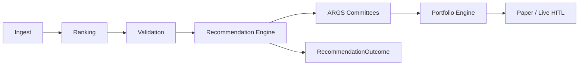

# Pi-PM Phase 2 — Product Definition Pack

> **PO sign-off (2026-06-04):** Phase 2 architecture **approved**. Implementation may begin after [PO_SIGNOFF_2026_06_04.md](./PO_SIGNOFF_2026_06_04.md) and [ADR-021](../architecture/ADR-021-Recommendation-Platform-Architecture.md) are in place. **Conviction has no committee weighting** — see [02_CONVICTION_SCORING_PRD.md](./02_CONVICTION_SCORING_PRD.md).

**Generated:** 2026-06-05  
**Repo:** `/Users/kalyancb/pi-pm`  
**Vision:** AI-Governed Swing Trading Operating System — India NSE equities, 15–30 day swing horizon, ~10% target, quality over quantity, cash allowed, human in the loop.

**Evidence base:** [`docs/po-discovery/`](../po-discovery/INDEX.md), [`docs/AI/`](../AI/README.md), application code (`app/`, `tests/`).

**Scope of this pack:** Product definition (PRDs, ADRs). **Implementation status:** see [`IMPLEMENTATION_SUMMARY.md`](../IMPLEMENTATION_SUMMARY.md) and [`audit/Executive_Summary.md`](../audit/Executive_Summary.md).

---

## Non-negotiables (carried from Phase 1 + PO sign-off)

| Rule | Source |
|------|--------|
| Deterministic ranking and validation are sacred; same inputs → same outputs | [`docs/AI/01_PRODUCT/PRD.md`](../AI/01_PRODUCT/PRD.md) G1, G8 |
| LLMs may produce research opinions; they must **not** rank, size positions, approve trades, or override validation | PRD G8, [PO sign-off](./PO_SIGNOFF_2026_06_04.md) |
| **Conviction** from five deterministic inputs only — **no committee weight** | [02](./02_CONVICTION_SCORING_PRD.md) |
| **Recommendation Engine** sits **between Validation and ARGS** | [ADR-021](../architecture/ADR-021-Recommendation-Platform-Architecture.md) |
| ARGS committee outputs: store/display/explain — **must not** affect conviction or `action` | [08](./08_AI_INVESTMENT_COMMITTEE_PRD.md) |
| Do not market rank #1 as “best buy” until calibration promoted | [po-discovery 10](../po-discovery/10_RECOMMENDATION_ENGINE_GAP_ANALYSIS.md) |

---

## Reading order (~6 hours for PO / board)

| Order | Document | Time | Audience |
|-------|----------|------|----------|
| 0 | [PO_SIGNOFF_2026_06_04.md](./PO_SIGNOFF_2026_06_04.md) | 10 min | PO, eng lead — gate |
| 1 | [15_EXECUTIVE_PRODUCT_STRATEGY.md](./15_EXECUTIVE_PRODUCT_STRATEGY.md) | 15 min | Board, founders |
| 2 | [12_PRODUCT_ROADMAP_2026_2027.md](./12_PRODUCT_ROADMAP_2026_2027.md) | 20 min | PO, engineering lead |
| 3 | [13_PO_BACKLOG.md](./13_PO_BACKLOG.md) | 30 min | PO, sprint planning |
| 4 | [01_RECOMMENDATION_ENGINE_PRD.md](./01_RECOMMENDATION_ENGINE_PRD.md) | 45 min | Core product — M1 |
| 5 | [02_CONVICTION_SCORING_PRD.md](./02_CONVICTION_SCORING_PRD.md) | 30 min | Quant + PO |
| 6 | [03_RECOMMENDATION_DATA_MODEL.md](./03_RECOMMENDATION_DATA_MODEL.md) | 30 min | Data / backend planning |
| 7 | [04_RECOMMENDATION_LIFECYCLE.md](./04_RECOMMENDATION_LIFECYCLE.md) | 25 min | PO, compliance |
| 8 | [16_WHY_NOT_RECOMMENDED_FRAMEWORK.md](./16_WHY_NOT_RECOMMENDED_FRAMEWORK.md) | 20 min | Product + mobile |
| 9 | [05_PORTFOLIO_ENGINE_PRD.md](./05_PORTFOLIO_ENGINE_PRD.md) | 35 min | M2 |
| 10 | [06_PAPER_TRADING_PRD.md](./06_PAPER_TRADING_PRD.md) | 30 min | M2 |
| 11 | [07_EXIT_DECISION_FRAMEWORK.md](./07_EXIT_DECISION_FRAMEWORK.md) | 30 min | M2 |
| 12 | [08_AI_INVESTMENT_COMMITTEE_PRD.md](./08_AI_INVESTMENT_COMMITTEE_PRD.md) | 35 min | ARGS evolution |
| 13 | [16_RECOMMENDATION_PERFORMANCE_PRD.md](./16_RECOMMENDATION_PERFORMANCE_PRD.md) | 25 min | P3 analytics |
| 14 | [17_TRUST_DASHBOARD_VISION.md](./17_TRUST_DASHBOARD_VISION.md) | 15 min | Future analytics |
| 15 | [11_HUMAN_IN_LOOP_EXECUTION_PRD.md](./11_HUMAN_IN_LOOP_EXECUTION_PRD.md) | 25 min | M3 |
| 16 | [09_MOBILE_APP_PRD.md](./09_MOBILE_APP_PRD.md) | 40 min | M4 |
| 17 | [10_AI_COPILOT_PRD.md](./10_AI_COPILOT_PRD.md) | 25 min | M4 |
| 18 | [14_ARCHITECTURE_IMPACT_ANALYSIS.md](./14_ARCHITECTURE_IMPACT_ANALYSIS.md) | 40 min | Engineering |
| 19 | [ADR-021](../architecture/ADR-021-Recommendation-Platform-Architecture.md) | 20 min | Engineering |

---

## Document index

| # | File | Summary |
|---|------|---------|
| — | [PO_SIGNOFF_2026_06_04.md](./PO_SIGNOFF_2026_06_04.md) | Approved principles, mandatory changes, P1–P7 gate |
| 01 | [01_RECOMMENDATION_ENGINE_PRD.md](./01_RECOMMENDATION_ENGINE_PRD.md) | Ranked stock → BUY/WATCH/HOLD/EXIT_APPROVED/REJECT; pipeline slot after validation |
| 02 | [02_CONVICTION_SCORING_PRD.md](./02_CONVICTION_SCORING_PRD.md) | Deterministic 0–100, five factors, **no committee** |
| 03 | [03_RECOMMENDATION_DATA_MODEL.md](./03_RECOMMENDATION_DATA_MODEL.md) | Entities, ER, `RecommendationOutcome` |
| 04 | [04_RECOMMENDATION_LIFECYCLE.md](./04_RECOMMENDATION_LIFECYCLE.md) | CANDIDATE → APPROVED → ACTIVE → EXIT_APPROVED → CLOSED |
| 05 | [05_PORTFOLIO_ENGINE_PRD.md](./05_PORTFOLIO_ENGINE_PRD.md) | Capital, regime slots, allocation, future sizing note |
| 06 | [06_PAPER_TRADING_PRD.md](./06_PAPER_TRADING_PRD.md) | Simulate lifecycle; attribution |
| 07 | [07_EXIT_DECISION_FRAMEWORK.md](./07_EXIT_DECISION_FRAMEWORK.md) | Exit research → live EXIT_APPROVED |
| 08 | [08_AI_INVESTMENT_COMMITTEE_PRD.md](./08_AI_INVESTMENT_COMMITTEE_PRD.md) | ARGS advisory; `HIGH_CONCERN` |
| 09 | [09_MOBILE_APP_PRD.md](./09_MOBILE_APP_PRD.md) | Five screens, wireframes, APIs |
| 10 | [10_AI_COPILOT_PRD.md](./10_AI_COPILOT_PRD.md) | Grounded retrieval, audit |
| 11 | [11_HUMAN_IN_LOOP_EXECUTION_PRD.md](./11_HUMAN_IN_LOOP_EXECUTION_PRD.md) | Approval workflow; broker integration |
| 12 | [12_PRODUCT_ROADMAP_2026_2027.md](./12_PRODUCT_ROADMAP_2026_2027.md) | M1–M4 + P1–P7 implementation order |
| 13 | [13_PO_BACKLOG.md](./13_PO_BACKLOG.md) | Epic / Feature / Story aligned to P1–P7 |
| 14 | [14_ARCHITECTURE_IMPACT_ANALYSIS.md](./14_ARCHITECTURE_IMPACT_ANALYSIS.md) | Reuse vs new; outcomes + rejection codes |
| 15 | [15_EXECUTIVE_PRODUCT_STRATEGY.md](./15_EXECUTIVE_PRODUCT_STRATEGY.md) | Board strategy |
| 16 | [16_WHY_NOT_RECOMMENDED_FRAMEWORK.md](./16_WHY_NOT_RECOMMENDED_FRAMEWORK.md) | Deterministic rejection codes + HFCL pattern |
| 16b | [16_RECOMMENDATION_PERFORMANCE_PRD.md](./16_RECOMMENDATION_PERFORMANCE_PRD.md) | Win rate, conviction/regime/committee effectiveness |
| 17 | [17_TRUST_DASHBOARD_VISION.md](./17_TRUST_DASHBOARD_VISION.md) | Future trust metrics UI |
| — | [ADR-021](../architecture/ADR-021-Recommendation-Platform-Architecture.md) | Governing Phase 2 architecture |
| 18 | [18_HUMAN_IN_LOOP_LIVE_INVESTING_PRD.md](./18_HUMAN_IN_LOOP_LIVE_INVESTING_PRD.md) | Track I — live HITL workflows |
| 19 | [19_BROKER_ADAPTER_PRD.md](./19_BROKER_ADAPTER_PRD.md) | BrokerAdapter contract (design only) |
| 20 | [20_RISK_CONTROL_PRD.md](./20_RISK_CONTROL_PRD.md) | Pre-trade risk gates |
| 21 | [21_EXECUTION_WORKFLOW_PRD.md](./21_EXECUTION_WORKFLOW_PRD.md) | End-to-end execution workflows |
| — | [ADR-030](../architecture/ADR-030-Live-Investing-Architecture.md) | Live investing architecture |
| — | [ADR-032](../architecture/ADR-032-Live-Entry-Timing-Validation-Gate.md) | Entry timing & validation gate (proposed) |
| — | [ADR-033](../architecture/ADR-033-Intraday-Exit-Monitor-And-Stop-Override.md) | Intraday exit monitor & stop override (proposed) |

---

## Phase 2 target pipeline (product)

**Implementation status (2026-06-05):** P1–P3 + M2 **shipped** (recommendation engine, portfolio, paper execution, outcomes schema). P6 mobile + P7 copilot **partial** (frontend 8/10 screens). AC-RISK + live broker **not started**. Scores: [maturity scorecard](../po-discovery/PRODUCT_MATURITY_SCORECARD.md) (rescored), [audit scorecard](../audit/PLATFORM_READINESS_SCORECARD.md).

---

## Implementation priority (PO P1–P7)

| Priority | Scope |
|----------|--------|
| P1 | Recommendation domain — tables, APIs, lifecycle |
| P2 | Recommendation engine + conviction |
| P3 | Outcomes + performance + trust metrics |
| P4 | Portfolio engine |
| P5 | Paper trading |
| P6 | Mobile |
| P7 | AI Copilot |

Detail: [13_PO_BACKLOG.md](./13_PO_BACKLOG.md).

---

## Cross-references

- [IMPLEMENTATION_SUMMARY.md](../IMPLEMENTATION_SUMMARY.md) — what was built
- [audit/Executive_Summary.md](../audit/Executive_Summary.md) — independent verification
- [10_RECOMMENDATION_ENGINE_GAP_ANALYSIS.md](../po-discovery/10_RECOMMENDATION_ENGINE_GAP_ANALYSIS.md) — **stale** (pre-Phase 2)
- [11_PORTFOLIO_ENGINE_GAP_ANALYSIS.md](../po-discovery/11_PORTFOLIO_ENGINE_GAP_ANALYSIS.md) — **stale**
- [12_MOBILE_READINESS_ASSESSMENT.md](../po-discovery/12_MOBILE_READINESS_ASSESSMENT.md) — **stale**
- [15_EXECUTIVE_SUMMARY.md](../po-discovery/15_EXECUTIVE_SUMMARY.md)
- [PRODUCT_MATURITY_SCORECARD.md](../po-discovery/PRODUCT_MATURITY_SCORECARD.md)
