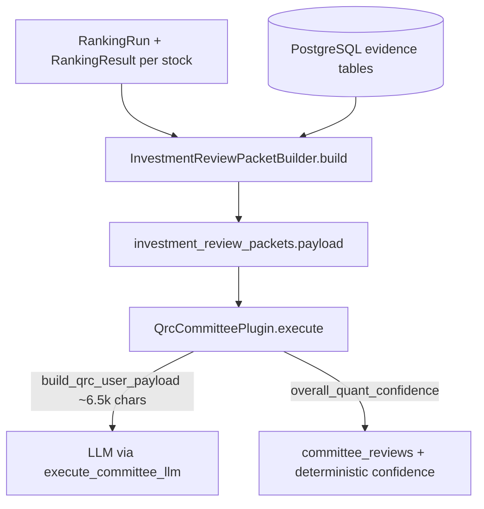
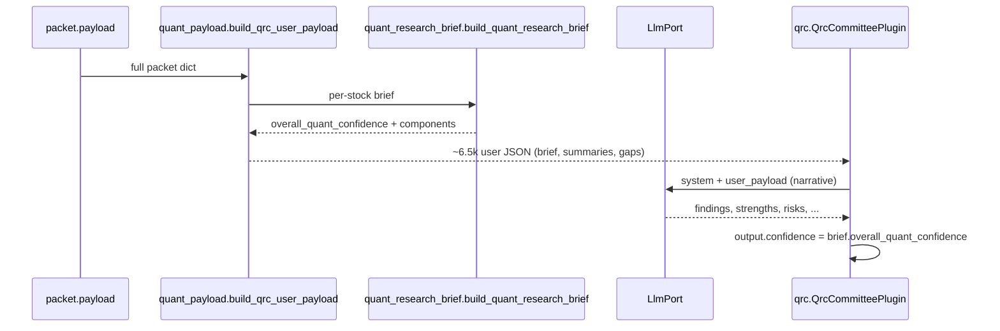

# QRC Information Compression Analysis

**Scope:** Analysis-only deliverable for Pi-PM ARGS (2026-06-02). No code changes.  
**Question:** Why is QRC confidence nearly flat across Top-20 stocks despite differentiated ranking factors, factor IC, regime, SEE, and historical validation?  
**Important:** Current-day forward validation pending (`status=pending`, `database_status=insufficient_data`) is **expected** on the ranking as-of date and must **not** be treated as a defect.

---

## Executive summary

| Layer | Finding |
|-------|---------|
| **Packet (`investment_review_packets.payload`)** | ~148k JSON chars/stock (breakout); **48%** is raw `factor_ic` (256 rows), **23%** exit research, **14%** historical validation context — almost all **strategy/run-level**, identical across Top-20. |
| **QRC LLM input** | `build_qrc_user_payload()` compresses to **~6.5k chars** (~96% reduction); raw factor/exit arrays **do not** reach the LLM. |
| **QRC confidence** | **Deterministic** from `quant_research_brief.overall_quant_confidence` (not LLM output). **55%** of rubric weight uses identical cross-stock scores; **45%** SEE drives the only meaningful spread. |
| **Observed dispersion (2026-06-02)** | Breakout `ab5cdf4c`: 0.62–0.73 (σ≈0.030, 10 unique). Momentum `bd293670`: 0.61–0.72 (σ≈0.028, 8 unique). Still a **narrow band** vs ranking/SEE spread. |
| **Prior flat plateaus** | Sparse packets → all **0.56** (packet-level rubric). Rich packets + old rubric → all **0.93**. Both are rubric saturation on uniform inputs. |

---

## 1. Packet construction audit

### 1.1 Pipeline



**Entry point:** `app/args/builders/investment_review_packet_builder.py` — `InvestmentReviewPacketBuilder.build(ranking_run, result, stock)`.

**Enrichers / attachments:**

| Step | Function / module | Stock-specific? | Payload key |
|------|-------------------|-----------------|-------------|
| Validation report | `_load_validation_metrics` + `normalize_validation_status_for_packet` | No (one report per ranking run) | `validation` |
| Historical validations | `_load_historical_validation_context` | No (strategy window) | `historical_validation_context` |
| Factor IC | `_load_factor_ic` | No (strategy/universe/regime/date) | `quant_evidence.factor_ic` |
| Factor daily | `_load_factor_daily` | No (ranking_run_id or strategy fallback) | `quant_evidence.factor_daily` |
| Exit research | `_load_exit_research` | No (strategy/universe/regime) | `quant_evidence.exit_research` |
| Regime performance | `_load_strategy_regime_performance` | No (strategy) | `regime.strategy_regime_performance` |
| Research intelligence | `_load_research_context` | No (universe latest run) | `research_context` |
| Market / historical perf | `_load_market_snapshot`, `_load_historical_performance` | **Yes** | `market_snapshot`, `historical_performance` |
| SEE | `attach_stock_setup_evidence` (`app/stock_setup_evidence/packet_enricher.py`) | **Yes** | `stock_setup_evidence` |
| Coverage meta | `score_packet_evidence`, `derive_evidence_confidence` | Mostly no (identical when quant blocks match) | `evidence_coverage`, `evidence_confidence` |

**Persisted shape:** `InvestmentReviewPacket` model → `investment_review_packets.payload` (JSONB) with `packet_hash` from `compute_packet_hash(payload)`.

### 1.2 What committees actually receive

| Committee | User payload source | Sees raw `factor_ic`? |
|-----------|---------------------|------------------------|
| **QRC** | `build_qrc_user_payload()` | **No** — summarized brief + aggregates |
| TARC | `ranking`, `technical_factors`, `regime`, `historical_performance` | No |
| FRC | `market_snapshot`, `fundamental_snapshot`, `research_context` | No |
| RC / NRCC | Subsets of packet | No |

Only the **full packet** in DB/API exports contains 256-row factor IC arrays; QRC never serializes them to the model.

---

## 2. Packet size by section (2026-06-02 breakout)

**Source:** `docs/args-breakout-2026-06-02.md` (research run `ab5cdf4c-9789-4a35-8700-604c44bb521c`, ranking run `b8e993e4-a049-4f3a-bcd0-29574a0f7e47`).  
**Method:** `len(json.dumps(section))` on first packet; all 20 packets share identical sizes for strategy-level sections.

### 2.1 Full packet (~148,285 chars)

| Section | Chars | % of total | Rows / notes |
|---------|------:|-----------:|--------------|
| `quant_evidence.factor_ic` | 71,590 | **48.3%** | 256 metrics × all stocks |
| `quant_evidence.exit_research` | 34,180 | **23.1%** | 100 policy metrics × all stocks |
| `historical_validation_context` | 20,059 | **13.5%** | 12 recent completed validations × all stocks |
| `stock_setup_evidence` (SEE) | 5,643 | **3.8%** | **Per stock** |
| `research_context` | 1,329 | 0.9% | Shared notes + compact reports |
| `ranking` + `technical_factors` | 2,336 | 1.6% | **Per stock** (rank, score_components) |
| `regime` | 653 | 0.4% | 4 regime rows × all stocks |
| `validation` (current run) | 250 | 0.2% | pending; empty horizon/decile arrays |
| Other (market, lineage, coverage, …) | ~12k | ~8% | |

### 2.2 Cross-stock uniqueness (Top 20, same run)

| Field | Unique values / 20 |
|-------|-------------------|
| `validation.report_id` | 1 |
| `factor_ic` row count | 1 (256) |
| `exit_research` row count | 1 (100) |
| `regime` performance rows | 1 (4) |
| `setup_evidence_score` (SEE) | **20** |
| `packet_hash` | **20** (ranking + SEE differ) |

**Conclusion:** Factor IC raw arrays **dominate stored packet bytes** but are **not** what differentiates QRC inputs today; they **overwhelm** other evidence only in storage/exports, not in the QRC LLM path.

### 2.3 Momentum comparison (`bd293670-b051-4f4a-94cd-b625e4ff5a2d`)

| Section | Chars | % of total |
|---------|------:|-----------:|
| Total packet | 99,711 | 100% |
| `factor_ic` | 35,816 | 35.9% |
| `exit_research` | 27,464 | 27.5% |
| `historical_validation_context` | 20,064 | 20.1% |
| SEE | 5,681 | 5.7% |

Momentum uses **128** factor IC rows (vs 256 breakout); same structural issue, smaller absolute payload.

---

## 3. QRC flow: LLM vs deterministic confidence

### 3.1 Code path



**Files:**

- `app/args/plugins/quant_research_brief.py` — deterministic assessments + weighted confidence  
- `app/args/plugins/quant_payload.py` — compression, coverage/gaps (display extensions)  
- `app/args/plugins/qrc.py` — prompt contract; **overwrites** LLM `confidence` with rubric score  

### 3.2 QRC user payload size breakdown (HFCL.NS sample)

| Sub-object | Chars | % of QRC payload |
|------------|------:|-----------------:|
| `quant_research_brief` | 2,855 | 43.8% |
| `exit_research_summary` | 1,703 | 26.1% |
| `validation_summary` | 699 | 10.7% |
| `instructions` + diagnostics | ~1,262 | 19.4% |
| **Total** | **6,519** | 100% |

**Compression ratio:** 148,308 (full packet) → 6,519 (QRC) ≈ **22.7×** smaller.

### 3.3 Confidence formula (current)

| Component | Weight | Breakout 2026-06-02 across Top-20 |
|-----------|-------:|----------------------------------|
| SEE | **45%** | 20 unique scores (σ≈0.064 on component) |
| Historical strategy | 20% | **1** value (0.7325) |
| Regime fit | 15% | **1** value (0.83) |
| Factor quality | 15% | **1** value (0.6011) |
| Validation status (informational) | 5% | **1** value (0.50 pending-neutral) |

**Effective spread:** Only ~45% of the weighted sum can move between names → theoretical max swing ≈ `0.45 × (max SEE − min SEE)` ≈ `0.45 × 0.23` ≈ **0.10** on overall confidence, observed **0.11** (0.62–0.73). Historical/regime/factor **cannot** widen QRC further until they become stock- or slice-specific.

---

## 4. Proposed Quant Research Brief layer (design reference)

The codebase already implements `build_quant_research_brief()`. This section defines the **target information architecture** for docs/product alignment and a **further condensed** LLM-facing shape.

### 4.1 Hierarchy (when current validation is pending)

```text
1. historical_strategy_assessment   ← from historical_validation_context (shared)
2. current_regime_assessment        ← from regime.strategy_regime_performance (shared)
3. factor_assessment                ← top ± factors + stability (shared aggregates)
4. see_assessment                   ← PRIMARY per-stock differentiator
5. validation_status                ← informational; pending = 0.50 neutral
```

### 4.2 Proposed condensed brief (optional second-stage compression)

For token budgeting or committee dashboards, a **~1k char** “headline brief” can drop duplicate factor rows and extension metadata:

```json
{
  "symbol": "HFCL.NS",
  "overall_quant_confidence": 0.6789,
  "regime_summary": {
    "label": "BEAR_LOW_VOL",
    "fit": "strong_fit",
    "avg_ic": -0.09130712,
    "avg_spread": -0.03197109
  },
  "historical_validation_summary": {
    "quality": "moderate",
    "rank_ic": 0.14012173,
    "decile_spread": -0.01027508,
    "sample_size": 347
  },
  "top_factors": {
    "positive": [{"factor_name": "high_proximity", "ic": 0.1027, "horizon": 60}],
    "negative": [{"factor_name": "high_proximity", "ic": -0.1464, "regime_label": "BEAR_LOW_VOL"}],
    "avg_abs_ic": 0.0317
  },
  "see_assessment": {
    "score": 62.89,
    "qualifying": 97,
    "win_rate_20d": 0.429,
    "avg_return_20d": 0.035
  },
  "validation_status": "pending"
}
```

**~1,007 chars** vs **6,519** current QRC user payload (~6.5× additional compression).

### 4.3 Sections to include in product brief (checklist)

| Section | Source in packet | Role |
|---------|------------------|------|
| Regime summary | `regime` + validation regime label | Context for SEE regime row selection |
| Historical validation summary | `historical_validation_context` | Strategy quality when current run pending |
| Top ± factors + stability | `quant_evidence.factor_ic` (aggregated) | Factor quality; not per-stock exposure today |
| SEE assessment | `stock_setup_evidence` | Win rate, returns, match counts for current regime |
| Validation status | `validation.status` | Display only; pending neutral |

---

## 5. Stock examples (2026-06-02 breakout)

### 5.1 “Current packet input” vs QRC path

| Symbol | Rank | Composite | Ranking JSON | factor_ic JSON | SEE score |
|--------|-----:|----------:|-------------:|---------------:|----------:|
| HFCL.NS | 1 | 0.8873 | 1,374 | **71,590** (256 rows, **identical** across Top-20) | 62.89 |
| WOCKPHARMA.NS | 2 | 0.8868 | 1,375 | 71,590 | **71.54** |
| THERMAX.NS | 3 | 0.8858 | 1,375 | 71,590 | 59.88 |
| TRITURBINE.NS | 12 | 0.8424 | 1,376 | 71,590 | 62.04 |

**Representative ranking excerpt (HFCL — stock-specific):**

```json
{
  "rank": 1,
  "composite_score": 0.8872816,
  "score_components": {
    "volatility_adjusted_momentum": { "normalized": "0.973799", "weighted": "0.19475980" },
    "relative_strength": { "normalized": "0.978166", "weighted": "0.14672490" },
    "high_proximity": { "normalized": "0.908297", "weighted": "0.13624455" }
  }
}
```

**Representative validation block (all four — run-level, pending expected):**

```json
{
  "status": "pending",
  "database_status": "insufficient_data",
  "pending_reason": "forward_return_horizons_not_available",
  "horizon_metrics": [],
  "decile_metrics": [],
  "regime_label": "BEAR_LOW_VOL"
}
```

### 5.2 Condensed Quant Research Brief (proposed / computed from same packets)

| Symbol | Overall QRC conf. | SEE q-score | Hist. | Regime fit | Factor q. | SEE score | Win% 20d |
|--------|------------------:|------------:|------:|-----------:|----------:|----------:|---------:|
| WOCKPHARMA.NS | **0.714** | 0.729 | 0.733 | 0.83 | 0.601 | 71.54 | 62.5% |
| TRITURBINE.NS | 0.695 | 0.687 | 0.733 | 0.83 | 0.601 | 62.04 | 37.5% |
| HFCL.NS | 0.679 | 0.651 | 0.733 | 0.83 | 0.601 | 62.89 | 42.9% |
| THERMAX.NS | **0.648** | 0.582 | 0.733 | 0.83 | 0.601 | 59.88 | 40.0% |

Historical/regime/factor columns are **identical**; spread is almost entirely SEE-driven (WOCKPHARMA highest SEE → highest QRC; THERMAX lowest SEE → lowest QRC).

---

## 6. Why QRC confidence is nearly flat

### 6.1 Three historical regimes

| Era | Example run | QRC min–max | Unique | Mechanism |
|-----|-------------|-------------|--------|-----------|
| **Sparse packet plateau** | `3fa420d1` (2026-06-01) | 0.56 – 0.56 | 1 | No horizon/decile/IC/regime rows; identical exit slice; packet-level rubric → `0.56` |
| **Rich packet + old rubric** | `dd5aa350` (pre-brief) | 0.93 – 0.93 | 1 | High `validation_coverage` / evidence_confidence identical → saturation high |
| **Brief + SEE-weighted (current)** | `ab5cdf4c` / `575a4dd8` breakout | 0.62 – 0.73 | 10 | SEE 45% varies; 55% shared → narrow band |

### 6.2 Root causes (2026-06-02 “nearly flat”)

1. **Packet-level vs stock-level signals**  
   Ranking `score_components`, factor IC tables, exit research, historical validation context, and regime performance are **the same JSON** for every symbol in the batch. They do not encode “why HFCL vs THERMAX” for QRC.

2. **Rubric saturation on shared components**  
   With pending current validation, all stocks get `validation_status` informational score **0.50** (by design). Historical + regime + factor subscores are **shared**, so ~**0.55** of the weighted sum is constant.

3. **SEE differentiation is real but damped**  
   SEE component σ≈0.064 across 20 names, but at 45% weight it yields overall σ≈**0.029** — visually “flat” next to composite scores spanning 0.81–0.89.

4. **Not an LLM averaging problem**  
   `QrcCommitteePlugin` sets `output.confidence` from `overall_quant_confidence`, not from model-reported confidence. Flat output reflects **deterministic inputs**, not prompt failure.

5. **Pending validation is neutral (not a bug)**  
   `normalize_validation_status_for_packet` maps `insufficient_data` → `pending` with reason `forward_return_horizons_not_available`. QRC explicitly must **not** penalize this; historical context substitutes for narrative.

6. **factor_ic in DB ≠ stock signal for QRC**  
   256 rows support strategy-level factor quality assessment; without per-stock factor attribution in the packet, they **cannot** differentiate confidence (only SEE can).

### 6.3 What is *not* causing flat QRC today

| Hypothesis | Verdict |
|------------|---------|
| Raw factor_ic dumped to LLM | **False** — `build_qrc_user_payload` omits raw arrays |
| LLM ignores SEE | **Partially irrelevant** — confidence is overwritten by brief |
| Missing historical validation | **False** on 2026-06-02 — 12 completed reports in context |
| Pending validation treated as failure | **False** — explicit neutral 0.50 |

---

## 7. How redesign creates stock differentiation

### 7.1 Implemented: SEE-weighted Quant Research Brief

```text
overall = clamp(
  0.45 * see_quality
  + 0.20 * historical_quality   # shared
  + 0.15 * regime_fit           # shared
  + 0.15 * factor_quality       # shared
  + 0.05 * validation_info,     # 0.50 when pending
  0.15, 0.95)
```

**Effect (documented in `docs/qrc-evidence-model-redesign.md`):**

| Strategy | Before brief | After brief |
|----------|-------------|-------------|
| Breakout | 0.93 flat (1 unique) | 0.62–0.73 (10 unique, σ≈0.030) |
| Momentum | 0.86 flat (1 unique) | 0.61–0.72 (8 unique, σ≈0.028) |

### 7.2 Further differentiation (not yet in packet)

| Enhancement | Stock-level? | Expected impact on QRC spread |
|-------------|--------------|------------------------------|
| Per-stock validation / forward metrics | Yes | Widens historical + validation components |
| Factor exposure / attribution per symbol | Yes | Widens factor_assessment beyond shared IC pool |
| Regime-conditional ranking components in brief | Partial | Links TARC-style technical story to QRC |
| Stronger SEE regime row weighting when label matches `BEAR_LOW_VOL` | Yes | Amplifies existing SEE spread |

---

## 8. Committee_reviews QRC dispersion (exports)

### 8.1 2026-06-02 breakout — `ab5cdf4c-9789-4a35-8700-604c44bb521c`

| Metric | Value |
|--------|------:|
| Min | 0.62 |
| Max | 0.73 |
| Mean | 0.678 |
| Std dev | 0.030 |
| Unique (rounded 2dp) | 10 |
| `quant_research_brief` in extensions | 20 / 20 |

**Per-symbol QRC confidence (committee_reviews):**

| Symbol | QRC | Symbol | QRC |
|--------|----:|--------|----:|
| LAURUSLABS.NS | 0.73 | RRKABEL.NS | 0.67 |
| WOCKPHARMA.NS | 0.71 | TATATECH.NS | 0.67 |
| ADANIENSOL.NS | 0.71 | AIAENG.NS | 0.66 |
| WELCORP.NS | 0.71 | THERMAX.NS | 0.65 |
| HONASA.NS | 0.70 | NSLNISP.NS | 0.65 |
| SOLARINDS.NS | 0.70 | OFSS.NS | 0.64 |
| TRITURBINE.NS | 0.70 | ATGL.NS | 0.62 |
| HFCL.NS | 0.68 | GLAND.NS | 0.62 |
| VIJAYA.NS | 0.68 | | |
| ZYDUSLIFE.NS | 0.68 | | |
| GRANULES.NS | 0.69 | | |
| NEULANDLAB.NS | 0.69 | | |

### 8.2 2026-06-02 momentum — `bd293670-b051-4f4a-94cd-b625e4ff5a2d`

| Metric | Value |
|--------|------:|
| Min | 0.61 |
| Max | 0.72 |
| Mean | 0.668 |
| Std dev | 0.028 |
| Unique | 8 |

### 8.3 Contrast: sparse-data run (`3fa420d1`, 2026-06-01)

| Metric | Value |
|--------|------:|
| QRC confidence | **0.56** for all 20 |
| validation_coverage | 20% all |
| factor_ic rows in packet | 0 |

See `docs/qrc-root-cause-analysis.md`, `docs/tarc-qrc-upgrade-validation.md`.

---

## 9. Related artifacts

| Document / script | Use |
|-------------------|-----|
| `docs/args-breakout-2026-06-02.md` | Full packet + review export (`ab5cdf4c`) |
| `docs/args-momentum-2026-06-02.md` | Momentum export (`bd293670`) |
| `docs/args-breakout-2026-06-02-qrc-redesign.md` | Same ranking run, redesign validation export (`575a4dd8`) |
| `docs/qrc-evidence-model-redesign.md` | Before/after dispersion tables |
| `docs/args-packet-evidence-audit.md` | DB coverage audit (`generate_packet_evidence_audit.py`) |
| `scripts/export_args_research_run.py` | Regenerate exports |

---

## 10. Conclusions

1. **Investment review packets are storage-heavy and strategy-heavy:** ~71% of JSON is shared `factor_ic` + `exit_research` + historical validation; **SEE (~4%) is the main per-stock quant narrative in the packet.**

2. **QRC already compresses information** before the LLM; flat confidence is **not** because raw IC arrays flood the model.

3. **Near-flat QRC today (σ≈0.03)** is the expected outcome of a **SEE-weighted rubric** when **55% of weights** attach to **identical** historical/regime/factor/validation-neutral scores on the same ranking run.

4. **Pending current validation** is correct for 2026-06-02; historical context supplies strategy validation; neutral scoring prevents false negatives.

5. **Meaningful widening** requires either stronger SEE dispersion, stock-level validation/factor slices in the packet, or additional per-stock terms in the brief—not re-sending 256-row IC tables to the LLM.

---

*Generated for ARGS QRC analysis. Metrics computed from export markdown JSON via local replay of `build_qrc_user_payload` / `build_quant_research_brief` (2026-06-03).*
