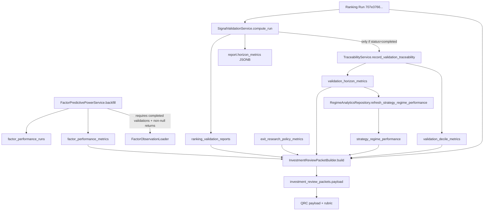

# Quant Metrics Forensic Analysis

**Investigation type:** Read-only forensic sprint (no code changes, no migrations, no QRC changes)  
**Target ranking run:** `707e3766-fa3f-4570-8525-7a187189c1e5`  
**Related ARGS validation run:** `3fa420d1-9b2d-45f7-a26a-bd47352e2d3d`  
**Strategy context:** `breakout_v1` / `1.0.0` / `NIFTY_500` / `as_of_date=2026-06-01` / `regime_label=BEAR_LOW_VOL`

---

## 1. Executive Summary

ARGS received zero horizon, decile, factor IC, and regime metrics for ranking run `707e3766-fa3f-4570-8525-7a187189c1e5` because:

1. **Validation for that run completed as `insufficient_data`** with zero usable forward-return samples at all horizons (`5/10/20/60`).
2. **Relational metric tables (`validation_horizon_metrics`, `validation_decile_metrics`) are only materialized when validation status is `completed`**, so this run correctly has `0` relational rows.
3. **`factor_performance_metrics` has zero rows in the entire database**, despite completed factor backfill runs; the backfill window around `2026-06-01` had **zero completed validation reports**, so factor IC generation wrote nothing.
4. **`strategy_regime_performance` is empty globally** (never populated/refreshed), so regime performance cannot load.

This is primarily a **data generation / data readiness problem (A)**, with secondary **load-path behavior (D)** where packet assembly reads relational tables (not validation JSONB placeholders).

---

## 2. Table Inventory

| Table | Total rows | Latest timestamp | Latest strategy | Latest version | Latest universe | Latest regime |
|---|---:|---|---|---|---|---|
| `ranking_validation_reports` | 1,194 | `2026-06-01 14:55:12 UTC` | `momentum_v1` | `1.0.0` | `NIFTY_500` | `BEAR_LOW_VOL` |
| `validation_horizon_metrics` | 4,712 | `2026-06-01 03:47:28 UTC` | `breakout_v1` | `1.0.0` | `NIFTY_500` | `BEAR_LOW_VOL` |
| `validation_decile_metrics` | 45,640 | n/a (no date column) | `breakout_v1`* | `1.0.0`* | `NIFTY_500`* | `BEAR_LOW_VOL`* |
| `factor_performance_metrics` | **0** | n/a | n/a | n/a | n/a | n/a |
| `strategy_regime_performance` | **0** | n/a | n/a | n/a | n/a | n/a |

\*Latest strategy/version/universe/regime inferred from joined validation report lineage of most recent decile rows.

### Status distribution (`ranking_validation_reports`)

| Status | Count |
|---|---:|
| `completed` | 1,178 |
| `insufficient_data` | 16 |

### Supporting pipeline tables

| Table | Observation |
|---|---|
| `factor_performance_runs` | 6 runs, all `completed`, but all show `reports_processed=0`, `metrics_written=0` |
| `factor_daily_metrics` | 0 rows |
| `exit_research_policy_metrics` | Present (`120` rows for `breakout_v1` + `BEAR_LOW_VOL`) |
| `market_data` max date | `2026-06-01` (same as target run `as_of_date`) |

---

## 3. Data Lineage Diagram



---

## 4. Data Availability Matrix (Target Run)

Ranking run: `707e3766-fa3f-4570-8525-7a187189c1e5`

| Dataset | Available in DB for this run? | Loaded into packet? | Differentiated across top-20? | Primary source |
|---|---|---|---|---|
| Validation report | Yes (`87a91a73-c9a8-4467-b47e-cef47ec78086`, `insufficient_data`) | Yes (status/regime/report_id) | No (same report for all stocks) | `ranking_validation_reports` |
| Horizon metrics (relational) | **No (0 rows)** | **No (`[]`)** | No | `validation_horizon_metrics` |
| Decile metrics (relational) | **No (0 rows)** | **No (`[]`)** | No | `validation_decile_metrics` |
| Factor IC metrics | **No (0 rows globally)** | **No (`[]`)** | No | `factor_performance_metrics` |
| Exit research metrics | Yes (strategy/regime scoped, 50 rows injected) | Yes | No (identical slice per stock) | `exit_research_policy_metrics` |
| Regime performance metrics | **No (0 rows globally)** | **No (`[]`)** | No | `strategy_regime_performance` |

---

## 5. Repository Query Analysis

### Validation (`RankingValidationRepository` + packet loader)

- Packet builder resolves report by `ranking_run_id` via `get_by_ranking_run_id`.
- Horizon/decile payload is loaded from relational tables only (`_load_validation_metrics`), not from `ranking_validation_reports.horizon_metrics` JSONB.
- For target run: relational counts are `0`, so packet gets empty arrays.

### Factor IC (`FactorPerformanceMetricRepository.list_metrics`)

Packet builder filter:

- `strategy_name = ranking_run.strategy_name`
- `strategy_version = ranking_run.strategy_version`
- `universe_code = ranking_run.universe_code`
- `regime_label = validation regime`
- `as_of_date_end = ranking_run.as_of_date` (**exact match**)

Current DB state: `factor_performance_metrics` total rows = `0`, so query correctly returns empty regardless of filter precision.

### Exit research (`ExitResearchMetricRepository.list_policy_metrics`)

- Strategy + universe + regime scoped (not stock scoped).
- Packet injects first 50 policy rows after strategy-version filter.
- This dataset is present and loaded, but identical across stocks.

### Regime performance (`RegimeAnalyticsRepository.list_strategy_regime_performance`)

- Strategy/version scoped, optional regime filter.
- Table is empty globally (`0` rows), so packet receives `[]`.

---

## 6. Filter Analysis

| Stage | Filter | Effect on target run |
|---|---|---|
| Validation traceability gate | `report.status == completed` required to write `validation_horizon_metrics` / `validation_decile_metrics` | Blocks materialization because status is `insufficient_data` |
| Forward-return computation | Requires future trading bars after `as_of_date` | Fails because `market_data.max(date)=2026-06-01` equals run `as_of_date` |
| Factor observation loader | Requires `RankingValidationReport.status == completed` and non-null horizon return column | Zero eligible rows in `2026-05-29..2026-06-01` window |
| Factor metric upsert | Skips aggregates when `aggregate_metric(...)` returns `None` | Contributes to `metrics_written=0` |
| Packet factor IC query | Exact `as_of_date_end` match | Currently moot (table empty), but strict when data exists |
| Packet exit research slice | `limit=100`, then `[:50]` | Same 50 rows for every stock |

---

## 7. Missing Generation Analysis

### For ranking run `707e3766-fa3f-4570-8525-7a187189c1e5`

#### 1) Which validation report should have been used?

`87a91a73-c9a8-4467-b47e-cef47ec78086` (linked 1:1 by `ranking_run_id`).

#### 2) Was that validation report generated?

**Yes.** `computed_at=2026-06-01 14:55:03 UTC`, status=`insufficient_data`.

#### 3) Does it contain horizon metrics?

- **JSONB:** yes, keys `5/10/20/60`, but each horizon has `status=insufficient_data`, `sample_size=0`.
- **Relational (`validation_horizon_metrics`):** **no rows**.

`sample_summary`:

```json
{
  "ranked_stock_count": 459,
  "horizon_valid_counts": { "5": 0, "10": 0, "20": 0, "60": 0 }
}
```

#### 4) Does it contain decile metrics?

- **JSONB:** empty decile arrays per horizon.
- **Relational (`validation_decile_metrics`):** **no rows**.

#### 5) Does `factor_performance_metrics` contain rows for `breakout_v1`?

**No.** Table has `0` rows total (`breakout_v1` rows = `0`).

Factor backfill runs exist and are `completed`, but for window `2026-05-29..2026-06-01`:

- `reports_processed=0`
- `metrics_written=0`

#### 6) Does `strategy_regime_performance` contain rows for `breakout_v1`?

**No.** Table has `0` rows total.

#### 7) If yes, why were they not loaded?

Not applicable for factor IC / regime performance (no rows exist).

For validation horizon/decile: report exists, but relational metrics were intentionally not materialized due `insufficient_data` status.

#### 8) If no, why were they never generated?

**Horizon/decile (this run):**

- Validation executed, but no stock had computable forward returns.
- Evidence: `ranking_performance_snapshots` for this run: `return_5d/10d/20d/60d` non-null counts all `0`.
- Market data latest date equals run `as_of_date` (`2026-06-01`), so no post-as-of bars exist for forward horizons.

**Factor IC:**

- Backfill ran, but had zero completed validation reports in its date window (`2026-05-29` to `2026-06-01` all `insufficient_data`).
- `FactorObservationLoader` requires completed validation + non-null horizon returns, so observations = 0 -> metrics_written = 0.

**Strategy regime performance:**

- No rows globally; refresh job appears never populated table in this environment.

---

## 8. Root Cause (Ranked by Probability)

| Rank | Root cause | Classification | Evidence |
|---:|---|---|---|
| 1 | **No forward-return availability at `as_of_date=2026-06-01`** (market data ends on as-of day) | **A. Not generated** | `market_data.max(date)=2026-06-01`; snapshots all null returns; validation `horizon_valid_counts` all zero |
| 2 | **Validation status `insufficient_data` prevents relational horizon/decile materialization** | **A. Not generated** (relational) + design gate | `TraceabilityService` writes metrics only when status=`completed`; target has 0 horizon/decile rows |
| 3 | **Factor IC pipeline has no eligible completed validations in recent window** | **A. Not generated** | Factor runs `reports_processed=0`, `metrics_written=0`; `factor_performance_metrics` empty |
| 4 | **`strategy_regime_performance` never populated/refreshed** | **A. Not generated** | Global row count 0 |
| 5 | Packet loader reads relational validation tables, not JSONB placeholders | **D. Present but queried/loaded via path that yields empty** | JSONB has insufficient placeholders; packet `horizon_metrics=[]`, `decile_metrics=[]` |
| 6 | Incorrect linkage | **Unlikely** | Correct `ranking_run_id` -> report mapping exists |
| 7 | Incorrect filtering alone | **Unlikely as primary cause** | Queries behave correctly on completed runs (e.g., `6f067f04-...` has 4 horizon rows) |

**Overall verdict:** **E. Multiple causes**, dominated by upstream metric non-generation due to insufficient forward-return data at latest as-of date, cascading into empty factor/regime datasets and uniform QRC evidence.

---

## 9. Recommended Fix (Recommendations Only — Do Not Implement Here)

### Highest-impact fix

Ensure validation runs used by ARGS are **`completed` with non-zero horizon coverage** before research execution (gate on `horizon_valid_counts` and relational metric presence, not only report existence).

### Lowest-effort fix

For ARGS packet assembly, fail fast (or mark quant evidence degraded) when target run validation status is `insufficient_data` and relational horizon/decile counts are zero.

### Fastest path to restore metric generation

1. Ingest market data beyond current `as_of_date` so forward horizons can compute.
2. Re-run validation for affected dates until status=`completed`.
3. Re-run factor IC backfill for the same strategy/universe window.

### Fastest path to meaningful quant research quality

Require completed validation + populated `validation_horizon_metrics` + non-empty `factor_performance_metrics` before enabling QRC in production paths.

### Recommended implementation order

1. Data freshness gate: `as_of_date` must be strictly before latest market-data date by at least max horizon.
2. Validation quality gate: status=`completed` and `horizon_valid_counts[primary_horizon] > 0`.
3. Factor IC backfill gate: `metrics_written > 0` for strategy/version/universe/regime/date.
4. Regime performance refresh job scheduling + verification (`strategy_regime_performance` non-empty).
5. Only then re-evaluate QRC confidence dispersion.

---

## 10. Final Verdict

### Why did ARGS receive zero horizon, decile, factor IC, and regime metrics for ranking run `707e3766-fa3f-4570-8525-7a187189c1e5`?

Because the ranking run’s validation completed as **`insufficient_data` with zero forward-return samples**, so relational horizon/decile metrics were never materialized; factor IC metrics were never written anywhere in the database (factor backfill had zero eligible completed validations in the window); and strategy regime performance was never populated. ARGS packet loading then correctly read empty relational datasets for those components, leaving only shared strategy-level exit research evidence.

### Classification summary for investigation options

| Option | Applies? |
|---|---|
| A. Not generated | **Yes (primary)** |
| B. Generated but linked incorrectly | **No** |
| C. Present but filtered incorrectly | **Minor/secondary only** (strict `as_of_date_end` factor filter; not current blocker) |
| D. Present but queried incorrectly | **Partial** (packet uses relational tables; JSONB placeholders are not real metrics) |
| E. Multiple causes | **Yes** |

---

## Appendix: Side-by-Side Evidence (Requested Symbols)

For `HFCL.NS`, `WOCKPHARMA.NS`, `THERMAX.NS`, `LAURUSLABS.NS`, `TRITURBINE.NS` in ARGS run `3fa420d1-9b2d-45f7-a26a-bd47352e2d3d`, packet quant blocks are identical:

- `validation.status = insufficient_data`
- `validation.report_id = 87a91a73-c9a8-4467-b47e-cef47ec78086`
- `horizon_metrics = []`
- `decile_metrics = []`
- `quant_evidence.factor_ic = []`
- `regime.strategy_regime_performance = []`
- `quant_evidence.exit_research = 50` shared rows (same policy IDs across symbols)

This confirms the ARGS/QRC clustering is downstream of shared missing quant inputs, not per-symbol packet differentiation failure.
