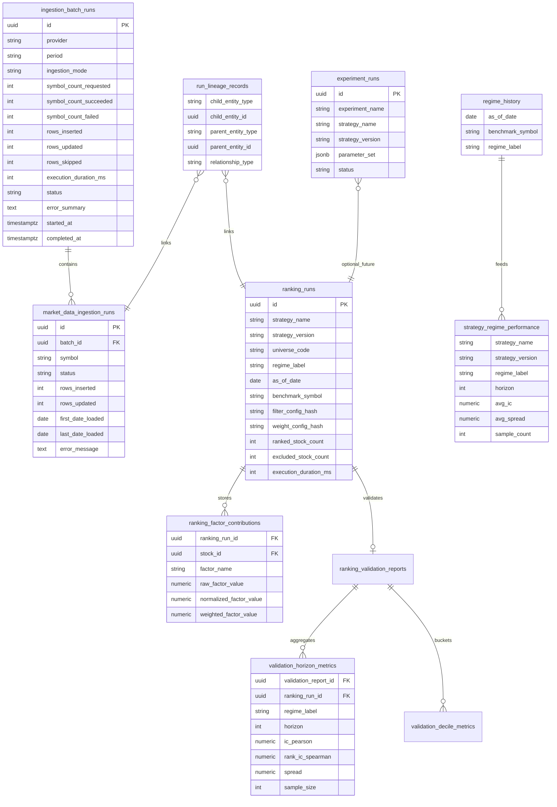

# Sprint 7 — Platform Traceability & Observability

Production-grade traceability foundation for Pi-PM: every ingestion, ranking, validation, and future research experiment can be traced, reproduced, audited, and resumed.

## Architecture Changes

### Layering

```
API (observability)
  └── ObservabilityService / RegimeAnalyticsService / ExperimentService
        └── Repositories (batch, lineage, factor contributions, validation metrics, regime)
              └── PostgreSQL traceability tables

Instrumented services (no scoring logic changes):
  MarketDataService  → batch runs + symbol runs + lineage
  RankingService     → factor contributions + ranking metadata
  SignalValidationService → horizon/decile metrics + lineage
```

### Design Principles

1. **Append-friendly audit trail** — batch and symbol ingestion runs, factor contributions, validation metrics stored in normalized tables alongside existing JSONB payloads.
2. **Lineage graph** — `run_lineage_records` links validation → ranking → ingestion without schema changes per strategy.
3. **Experiment registry** — `experiment_runs` with JSONB `parameter_set` supports breakout_v2, momentum_v2, regime_filter_v1 without migrations.
4. **Instrumentation only** — ranking engine, validation statistics, and factor math unchanged.

## Entity Relationship Diagram



## Schema Changes

Migration: `migrations/versions/20260530_0007_sprint7_platform_traceability.py`

| Table | Purpose |
|-------|---------|
| `ingestion_batch_runs` | Batch-level ingestion audit |
| `ranking_factor_contributions` | Per-stock factor decomposition |
| `validation_horizon_metrics` | Queryable IC/spread/hit rates by horizon |
| `validation_decile_metrics` | Decile bucket statistics |
| `run_lineage_records` | validation → ranking → ingestion graph |
| `experiment_runs` | Research experiment registry |
| `regime_history` | Daily regime classifications |
| `strategy_regime_performance` | Precomputed regime IC/spread rollups |

Altered columns on existing tables:
- `market_data_ingestion_runs`: `batch_id`, `ingestion_mode`, `first_date_loaded`, `last_date_loaded`
- `ranking_runs`: `regime_label`, `weight_config_hash`, `ranked_stock_count`, `excluded_stock_count`, `execution_duration_ms`

## API Changes

New router prefix: `/api/v1/observability`

| Method | Path | Description |
|--------|------|-------------|
| GET | `/health/platform` | Platform health summary |
| GET | `/ingestion/batches` | Recent ingestion batches |
| GET | `/ingestion/batches/{batch_id}` | Batch + symbol-level detail |
| GET | `/rankings/runs` | Recent ranking runs with traceability fields |
| GET | `/validation/metrics` | Queryable validation horizon metrics |
| GET | `/lineage/{entity_type}/{entity_id}` | Lineage graph for any entity |
| GET | `/rankings/{id}/stocks/{stock_id}/score-reconstruction` | Rebuild score from stored factors |
| GET/POST | `/experiments` | List / start experiments |
| POST | `/experiments/{id}/complete` | Mark experiment complete |
| GET | `/regime/current` | Current or historical regime |
| GET/POST | `/regime/performance` | List / refresh regime performance rollups |

Extended: `POST /api/v1/market-data/ingest` accepts optional `ingestion_mode`:
- `full_refresh` (default)
- `incremental` — fetch only bars after latest loaded date
- `backfill` — fetch period bars before earliest loaded date

## Structured Logging Events

| Event | Fields |
|-------|--------|
| `ingestion_started` | batch_id, provider, period, ingestion_mode, symbol_count |
| `ingestion_completed` | batch_id, status, rows_*, execution_duration_ms |
| `ranking_started` | universe_code, strategy_name, as_of_date, benchmark |
| `ranking_completed` | ranking_run_id, ranked_stock_count, execution_duration_ms |
| `validation_started` | ranking_run_id, strategy_name, as_of_date |
| `validation_completed` | validation_report_id, regime_label, execution_duration_ms |
| `experiment_started` | experiment_id, experiment_name, strategy_name |
| `experiment_completed` | experiment_id, status |

## Implementation Plan

### Phase 1 (this sprint) — Foundation ✅
- Migration + models
- Batch ingestion tracking + incremental modes
- Factor contribution persistence
- Validation metrics tables + lineage
- Experiment registry
- Regime history + performance rollups
- Observability API + structured logging

### Phase 2 — Operational hardening
- Async campaign execution with progress API (Sprint 6.2)
- Fix O(n²) directional hit rate in aggregation
- Link ranking runs to all universe symbol ingestion runs (not just benchmark)
- Experiment → ranking_run lineage automation

### Phase 3 — Research & AI
- Parameter sweep runner using `experiment_runs`
- Regime-filtered strategy selection using `strategy_regime_performance`
- AI optimization loop with experiment comparison API

## Verification SQL

```sql
-- Latest ingestion batch summary
SELECT id, provider, period, ingestion_mode,
       symbol_count_requested, symbol_count_succeeded, symbol_count_failed,
       rows_inserted, rows_updated, status, execution_duration_ms, started_at
FROM ingestion_batch_runs
ORDER BY started_at DESC
LIMIT 5;

-- Symbol-level ingestion for a batch
SELECT symbol, status, rows_inserted, rows_updated,
       first_date_loaded, last_date_loaded, error_message
FROM market_data_ingestion_runs
WHERE batch_id = '<batch_id>'
ORDER BY symbol;

-- Ranking run traceability
SELECT id, strategy_name, strategy_version, universe_code, regime_label,
       as_of_date, benchmark_symbol, filter_config_hash, weight_config_hash,
       ranked_stock_count, excluded_stock_count, execution_duration_ms
FROM ranking_runs
WHERE status = 'completed'
ORDER BY completed_at DESC
LIMIT 10;

-- Reconstruct score for a stock (should match ranking_results.score)
SELECT stock_id, factor_name, weighted_factor_value
FROM ranking_factor_contributions
WHERE ranking_run_id = '<ranking_run_id>'
ORDER BY stock_id, factor_name;

SELECT SUM(weighted_factor_value) AS reconstructed_score, stock_id
FROM ranking_factor_contributions
WHERE ranking_run_id = '<ranking_run_id>' AND stock_id = '<stock_id>'
GROUP BY stock_id;

-- Validation metrics by regime (breakout_v1 regime analysis)
SELECT regime_label,
       AVG(rank_ic_spearman) AS avg_ic,
       AVG(spread) AS avg_spread,
       COUNT(*) AS sample_count
FROM validation_horizon_metrics
WHERE strategy_name = 'breakout_v1'
  AND horizon = 20
GROUP BY regime_label
ORDER BY regime_label;

-- Full lineage: validation → ranking → ingestion
SELECT *
FROM run_lineage_records
WHERE child_entity_id = '<validation_report_id>'
   OR parent_entity_id = '<validation_report_id>';

-- Regime performance precomputed table
SELECT strategy_name, regime_label, horizon, avg_ic, avg_spread, sample_count, last_updated
FROM strategy_regime_performance
WHERE strategy_name = 'breakout_v1'
ORDER BY regime_label;

-- Active experiments
SELECT id, experiment_name, strategy_name, strategy_version, parameter_set, status, started_at
FROM experiment_runs
ORDER BY started_at DESC;
```

## Applying the Migration

```bash
cd /Users/kalyancb/pi-pm
alembic upgrade head
# or via Docker:
docker compose exec api alembic upgrade head
```

## Files Added/Modified

**New:**
- `app/models/platform_traceability.py`
- `app/core/structured_logging.py`
- `app/ranking/weight_hashing.py`
- `app/db/repositories/ingestion_batch_repository.py`
- `app/db/repositories/ranking_factor_contribution_repository.py`
- `app/db/repositories/validation_metrics_repository.py`
- `app/db/repositories/run_lineage_repository.py`
- `app/db/repositories/experiment_run_repository.py`
- `app/db/repositories/regime_analytics_repository.py`
- `app/services/traceability_service.py`
- `app/services/observability_service.py`
- `app/services/regime_analytics_service.py`
- `app/services/experiment_service.py`
- `app/api/v1/observability.py`
- `app/schemas/observability.py`
- `migrations/versions/20260530_0007_sprint7_platform_traceability.py`
- `tests/unit/services/test_platform_traceability.py`

**Modified (instrumentation only):**
- `app/services/market_data_service.py`
- `app/services/ranking_service.py`
- `app/services/signal_validation_service.py`
- `app/models/ranking_run.py`, `market_data_ingestion_run.py`
- `app/api/deps.py`, `app/api/router.py`
- `app/schemas/common.py`, `market_data.py`
- `app/providers/yahoo/client.py` (incremental fetch helper)
