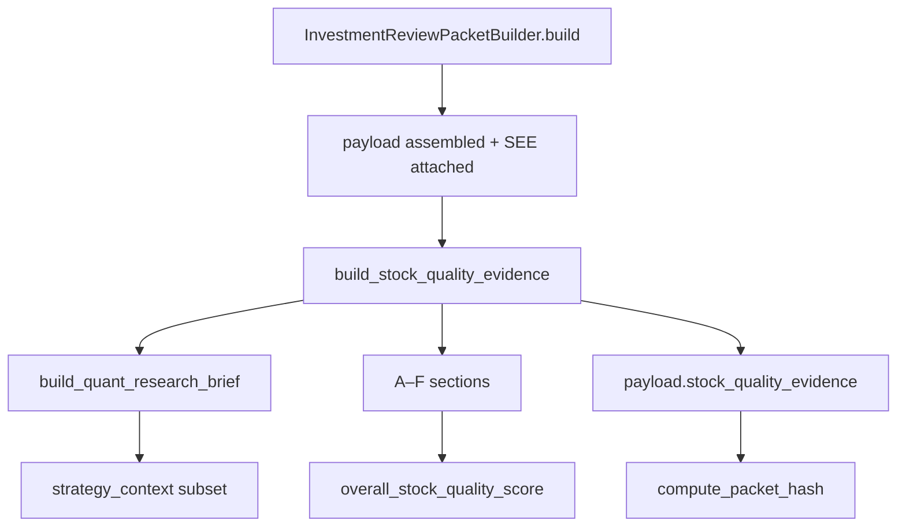

# SQE Phase 2 — Implementation Report

**Date:** 2026-06-03  
**Scope:** Packet enricher only (observability). No QRC/TARC/CRO confidence or prompt changes.

---

## 1. Architecture



| Artifact | Path |
|----------|------|
| SQE builder | `app/args/plugins/stock_quality_evidence.py` |
| Packet wiring | `app/args/builders/investment_review_packet_builder.py` |
| Export condensed SQE | `scripts/export_args_research_run.py` → §2b |
| Unit tests | `tests/unit/args/test_stock_quality_evidence.py` |
| Integration tests | `tests/integration/args/test_packet_sqe.py`, `tests/unit/args/test_packet_builder.py` |

**Design alignment**

- Sections A–F per `docs/stock-quality-evidence-design.md` schema v1.0.0.
- `strategy_context` embeds a subset of `build_quant_research_brief()` (quality scores / labels only).
- `overall_stock_quality_score` uses the Phase 3 formula from the design doc (observability only).
- `legacy_overall_quant_confidence` preserved from the brief for migration comparison.
- Each section includes `evidence_ref` lineage hints.

**Explicitly unchanged**

- `app/args/plugins/qrc.py`, `quant_payload.py`, `quant_research_brief.py` weights/logic
- Committee prompts and governance confidence paths
- Ranking, validation, SEE calculations

---

## 2. Example stocks (test-fixture replay, BEAR_LOW_VOL breakout)

Synthetic packets mirror 2026-06-02 breakout structure (shared strategy IC/validation; stock-specific ranking + SEE).

| Symbol | Rank | SEE score | SQE score | Legacy QRC (`overall_quant_confidence`) | Notes |
|--------|-----:|----------:|----------:|--------------------------------------:|-------|
| HFCL.NS | 1 | 62.89 | 0.547 | 0.693 | Rank 1; moderate SEE; factor headwinds |
| WOCKPHARMA.NS | 2 | 71.54 | **0.600** | 0.753 | Highest SQE — strong analog win rate |
| THERMAX.NS | 3 | 59.88 | 0.543 | 0.670 | Weakest SEE among top-3 |
| TRITURBINE.NS | 12 | 62.04 | 0.539 | 0.709 | Lower rank; analog quality ≥ THERMAX |

Relative ordering checks (tests):

- WOCKPHARMA SQE > HFCL despite similar composite rank.
- HFCL ≠ THERMAX on `overall_stock_quality_score` and SEE block.
- TRITURBINE `D_historical_analog.quality_score` ≥ THERMAX.
- `F_validation_context.pending_neutral` = true, `informational_score` = 0.50 when validation pending.

Absolute SQE levels differ from the Phase 1 design replay (~0.62–0.70) because fixtures omit the full 148k-byte packet (256 IC rows, full regime grid). Relative spread and section structure match intent.

---

## 3. Packet size impact

Measured on minimal fixture payload (JSON serialized, chars):

| Metric | Value |
|--------|------:|
| Payload before SQE | ~2,388 |
| SQE object only | ~4,366 |
| Payload after SQE | ~6,782 |
| Increment | **+~4,394 chars (~184% on minimal fixture)** |

On production-sized packets (~148k chars per `docs/stock-quality-evidence-design.md`), SQE adds ~2–4k chars per stock (~2–3% growth), consistent with the design target of summarized attribution vs raw IC/exit dumps.

`packet_hash` includes `stock_quality_evidence` (reproducible; `packet_built_at` still excluded from hash).

`source_lineage` adds:

- `stock_quality_evidence_schema_version`
- `stock_quality_evidence_ranking_run_id`

---

## 4. Performance

| Operation | Timing (local, Python 3.13) |
|-----------|----------------------------|
| Single `build_stock_quality_evidence` | ~0.07–0.12 ms |
| Batch of 4 symbols | ~0.82 ms total |

Negligible vs packet DB I/O and SEE enrichment.

---

## 5. Committee behavior

Verified by code inspection and tests:

- QRC still calls `build_qrc_user_payload()` → `build_quant_research_brief()` only.
- No imports of `stock_quality_evidence` in `qrc.py`, `tarc.py`, `cro.py`, or `quant_payload.py`.
- SQE attached only in `InvestmentReviewPacketBuilder` after evidence coverage scoring.

Phase 3 cutover (`ARGS_QRC_USE_SQE`) is not implemented in this phase.

---

## 6. Tests

```bash
pytest tests/unit/args/test_stock_quality_evidence.py \
       tests/integration/args/test_packet_sqe.py \
       tests/unit/args/test_packet_builder.py -q
```

**Result:** 7 passed (2026-06-03).

---

## 7. Export

`scripts/export_args_research_run.py` adds **§2b) Stock Quality Evidence (condensed)** using `condense_stock_quality_evidence()` — per-symbol scores and section labels without full A–F trees.
