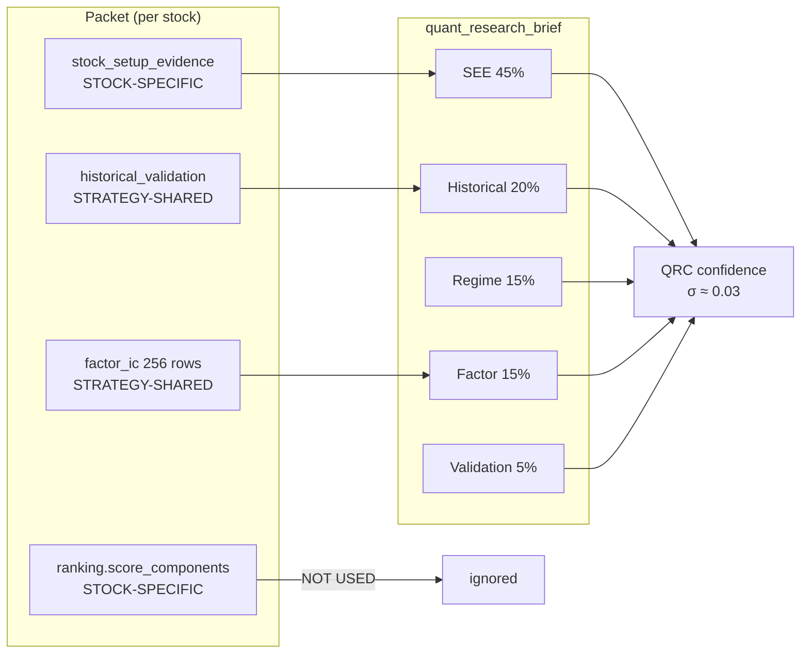
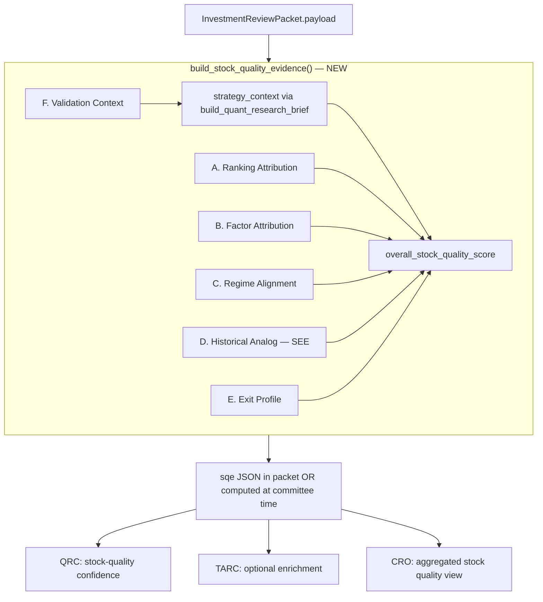

# Stock Quality Evidence (SQE) — Analysis & Design

**Scope:** Analysis and design only (Phase 1). No code changes.  
**Date:** 2026-06-03  
**Run validated:** Breakout `ab5cdf4c-9789-4a35-8700-604c44bb521c` (2026-06-02, ranking run `b8e993e4`)  
**Prior art:** `docs/qrc-information-compression-analysis.md`, `app/args/plugins/quant_research_brief.py`

---

## Executive summary

QRC answers **“how good is this strategy in this regime?”** more than **“how good is this stock?”** because 55% of deterministic confidence weight attaches to run-identical evidence (historical validation, regime fit, factor quality aggregate, pending-neutral validation). SEE is the only meaningful per-stock differentiator today (45% weight, σ≈0.066 on component vs σ≈0.030 overall).

**Stock Quality Evidence (SQE)** is a proposed per-stock evidence layer that reframes quant input for Investment Committee: stock-level ranking attribution, factor alignment (exposure × IC, not raw IC dump), regime-profile fit, SEE analog outcomes, exit-risk proxies, and strategy-only validation context. SQE **wraps and extends** `build_quant_research_brief()` — it does not replace it wholesale; strategy-level blocks remain as shared priors.

**Recommendation: Build SQE now (Phase 2–3)** — the data exists in packets today for 4 of 6 sections; factor attribution is computable at build time from `score_components × factor_ic`; exit profile requires SEE proxies until stock-level exit research exists. Expected QRC confidence σ widens from **~0.030 → ~0.045–0.065** with a stock-quality-weighted rubric, and relative ordering diverges from rank (e.g., HFCL rank 1 but QRC 0.68 vs WOCKPHARMA rank 2 QRC 0.71).

---

## 1. Validation of `qrc-information-compression-analysis.md`

### 1.1 Confirmed (code + 2026-06-02 export replay)

| Claim | Validated? | Evidence |
|-------|------------|----------|
| Packet ~148k chars; factor_ic 48%, exit 23%, historical 13%, SEE 4% | **Yes** | Export replay: 148,285 chars; 48.3% / 23.1% / 13.5% / 3.8% |
| factor_ic / exit / historical identical across Top-20 | **Yes** | Single unique JSON length per section; shared component scores unique=1 |
| QRC compresses to ~6.5k chars; raw IC not sent to LLM | **Yes** | `build_qrc_user_payload()` in `quant_payload.py`; HFCL QRC payload ~6,519 chars |
| Confidence deterministic from `overall_quant_confidence` | **Yes** | `QrcCommitteePlugin` overwrites LLM confidence with brief score |
| Weights: SEE 45%, historical 20%, regime 15%, factor 15%, validation 5% | **Yes** | `quant_research_brief.py` constants |
| 55% weight on identical components | **Yes** | historical/regime/factor/validation identical → 20+15+15+5 = **55%** |
| QRC σ≈0.030, range 0.62–0.73, 10 unique (2dp) | **Yes** | Export: stdev=0.0305, min=0.62, max=0.73 |
| Pending validation neutral at 0.50 | **Yes** | `_assess_validation_status()` + `normalize_validation_status_for_packet()` |
| SEE primary spread driver | **Yes** | SEE quality_score σ=0.066; overall σ=0.030 |

### 1.2 Overstated or imprecise

| Claim | Nuance |
|-------|--------|
| “factor_ic dominates differentiation” (storage) | Correct for **bytes**, not QRC path — already clarified in doc |
| “Further differentiation from per-stock factor exposure” | **Limited in BEAR_LOW_VOL breakout**: all 8 factors have negative IC except `relative_strength_acceleration` (+0.024, 5% weight). Positive-IC weight share σ≈**0.01** across Top-20 — factor alignment adds little spread in this regime |
| Implied rank ↔ QRC alignment | **False**: HFCL rank 1 → QRC 0.68; TRITURBINE rank 12 → QRC 0.70; WOCKPHARMA rank 2 → QRC 0.71 (highest) |
| `factor_daily` as packet evidence | **Empty on this run** (0 rows) — not a current differentiator |

### 1.3 Missing from prior analysis

| Gap | Impact |
|-----|--------|
| `ranking.score_components` stock-specific but **excluded from QRC confidence** | TARC uses them; QRC ignores — core SQE opportunity |
| `RankingFactorContribution` table syncs from score_components | DB-ready for attribution without new factor engine |
| `evidence_confidence` ~0.916 identical across rich packets | Packet-level meta; not in brief but saturates legacy rubrics |
| TARC confidence σ≈**0.013** (range 0.84–0.88) | Even rank-based committees compress on homogeneous Top-20 |
| SEE carries drawdown/runup analogs usable as exit proxies | Not wired to QRC confidence today |
| All BEAR_LOW_VOL factor ICs negative for breakout_v1 | Regime-strategy headwind is real; stock “quality” must be relative-within-batch |

---

## 2. Problem framing

### 2.1 User thesis (validated)

```
Investment Committee question:  "Should we own THIS stock?"
QRC current question:           "Does quant evidence support THIS STRATEGY in THIS REGIME?"
```

The mismatch is structural: 55% of QRC confidence is a **shared prior** (strategy validation + regime + factor pool quality). IC Committee sees nearly flat quant confidence (0.62–0.73) while composite scores span 0.81–0.89 and SEE scores span 56–77.

### 2.2 Root cause chain



---

## 3. Evidence source audit

| Source | Stock-level today? | SQE potential | How | Redundancy |
|--------|-------------------|---------------|-----|------------|
| **1. ranking.score_components** | **Yes** | **High** | Per-factor normalized/weighted/raw; rank, composite; concentration, breadth | Overlaps `technical_factors` (duplicate of components); TARC already consumes |
| **2. factor_ic / factor_daily** | No / empty | **Medium** (regime-conditional) | Cross join: `normalized × IC(regime)` → signed attribution, alignment score; **not** raw IC dump | Shared IC table; redundant if only aggregate quality repeated; `factor_daily` empty on 2026-06-02 |
| **3. historical_validation_context** | No | **Low** (strategy prior only) | Section F: single shared block; neutral framing | Same data as `quant_research_brief.historical_strategy_assessment` |
| **4. strategy_regime_performance** | No | **Medium** (via profile) | Compare stock factor profile to regime where strategy works (e.g., BULL_LOW_VOL avg_ic +0.038 vs BEAR_LOW_VOL −0.091) | Raw rows shared; **derived alignment** is stock-specific |
| **5. exit_research** | No | **Low** (strategy default) | Strategy-level best policy in summary; stock exit proxy from SEE `avg_max_drawdown`, `avg_max_runup` | 100 identical rows/stock; SEE drawdown partially redundant |
| **6. stock_setup_evidence (SEE)** | **Yes** | **High** | Matches, win rate, returns, CI, regime row — Section D | Primary QRC differentiator; SQE formalizes subset for all committees |
| **7. research_context** | No | **Low** | Universe notes; not per-stock | Informational only; no confidence weight |

### 3.1 Redundancy map

```text
HIGH REDUNDANCY (collapse in SQE output):
  - factor_ic raw rows ↔ quant_research_brief.factor_assessment (same aggregate)
  - exit_research raw rows ↔ exit_research_summary (same best/worst policies)
  - historical_validation_context ↔ historical_strategy_assessment
  - score_components ↔ technical_factors (exact duplicate in packet)

LOW REDUNDANCY (keep both layers):
  - SEE analog stats ↔ ranking attribution (different question: historical setups vs current factor rank)
  - Strategy regime table ↔ stock regime alignment score (shared input, derived per stock)
```

---

## 4. SQE architecture

### 4.1 Position relative to `quant_research_brief.py`

| Option | Verdict |
|--------|---------|
| **Replace** brief | ❌ — strategy priors (historical, shared factor pool) remain valid |
| **Wrap** brief | ✅ **Recommended** — SQE adds stock sections; brief becomes `sqe.strategy_context` + legacy confidence during migration |
| **Supersede** brief confidence | ✅ Phase 3 — `overall_stock_quality_score` replaces `overall_quant_confidence` for QRC/CRO |



### 4.2 Design principles

1. **Stock-first hierarchy** — ranking + SEE + factor alignment before strategy priors  
2. **No raw IC/exit dumps** — summarized attribution only (~1–2k chars/stock)  
3. **Strategy context explicit** — label shared blocks `scope: "strategy"` so IC knows the prior vs stock signal  
4. **Pending validation neutral** — inherit from brief; never penalize  
5. **Packet-grounded only** — no external data; deterministic scoring  

---

## 5. Proposed JSON schema

```json
{
  "schema_version": "1.0.0",
  "symbol": "HFCL.NS",
  "as_of_date": "2026-06-02",
  "ranking_run_id": "b8e993e4-a049-4f3a-bcd0-29574a0f7e47",

  "A_ranking_attribution": {
    "rank": 1,
    "composite_score": 0.8873,
    "top_contributors": [
      {"factor": "volatility_adjusted_momentum", "normalized": 1.0, "weighted": 0.20, "rank_among_factors": 1},
      {"factor": "relative_strength", "normalized": 1.0, "weighted": 0.15, "rank_among_factors": 2},
      {"factor": "high_proximity", "normalized": 0.992, "weighted": 0.149, "rank_among_factors": 3}
    ],
    "weakest_factor": {"factor": "consolidation_breakout", "normalized": 0.031},
    "signal_breadth": {"factors_above_0.8": 5, "factors_below_0.3": 1, "label": "STRONG_BREADTH"},
    "concentration_ratio_top3": 0.499,
    "quality_score": 0.92,
    "evidence_ref": "ranking:score_components"
  },

  "B_factor_attribution": {
    "current_regime_label": "BEAR_LOW_VOL",
    "method": "normalized_exposure_x_regime_ic",
    "net_signed_alignment": -0.665,
    "positive_ic_weight_share": 0.048,
    "top_headwinds": [
      {"factor": "high_proximity", "normalized": 0.992, "ic": -0.146, "signed_contribution": -0.145},
      {"factor": "relative_strength", "normalized": 1.0, "ic": -0.141, "signed_contribution": -0.141}
    ],
    "top_tailwinds": [
      {"factor": "relative_strength_acceleration", "normalized": 1.0, "ic": 0.024, "signed_contribution": 0.024}
    ],
    "quality_score": 0.38,
    "quality_label": "headwind_heavy",
    "note": "All primary breakout factors carry negative IC in BEAR_LOW_VOL; score reflects relative alignment within batch.",
    "evidence_ref": "ranking:score_components + quant_evidence:factor_ic"
  },

  "C_regime_alignment": {
    "current_regime_label": "BEAR_LOW_VOL",
    "strategy_in_current_regime": {"avg_ic": -0.091, "avg_spread": -0.032, "sample_count": 116},
    "strategy_best_regime": {"label": "BULL_LOW_VOL", "avg_ic": 0.038, "avg_spread": 0.016},
    "stock_profile_flags": {
      "high_momentum_in_bear_regime": true,
      "near_highs_in_bear_regime": true,
      "weak_breakout_confirmation": true
    },
    "alignment_score": 0.55,
    "alignment_label": "moderate_headwind",
    "evidence_ref": "regime:strategy_regime_performance + ranking:score_components"
  },

  "D_historical_analog": {
    "source": "stock_setup_evidence",
    "setup_evidence_score": 62.89,
    "qualifying_matches": 97,
    "total_matches": 102,
    "regime_label": "BEAR_LOW_VOL",
    "sample_size": 19,
    "win_rate_20d": 0.429,
    "avg_return_20d": 0.035,
    "median_return_20d": -0.037,
    "ci_95_20d": [-0.090, 0.160],
    "avg_max_drawdown_20d": 0.139,
    "quality_score": 0.651,
    "quality_label": "moderate",
    "evidence_ref": "stock_setup_evidence"
  },

  "E_exit_profile": {
    "strategy_default": {
      "best_policy": {"family": "FIXED_HOLD", "variant": "60", "mean_return": 0.047, "hit_rate": 0.637},
      "scope": "strategy",
      "evidence_ref": "quant_evidence:exit_research"
    },
    "stock_analog_proxy": {
      "expected_hold_horizon_days": 20,
      "analog_avg_max_drawdown": 0.139,
      "analog_avg_max_runup": 0.125,
      "drawdown_risk_label": "elevated",
      "scope": "stock",
      "evidence_ref": "stock_setup_evidence:regime_statistics"
    },
    "quality_score": 0.58
  },

  "F_validation_context": {
    "scope": "strategy",
    "current_run_status": "pending",
    "pending_neutral": true,
    "historical_substitute": {
      "quality_label": "moderate",
      "rank_ic": 0.140,
      "decile_spread": -0.010,
      "sample_size": 347,
      "as_of_date": "2026-05-11"
    },
    "informational_score": 0.50,
    "evidence_ref": "historical_validation_context + validation:status"
  },

  "strategy_context": {
    "_from": "build_quant_research_brief",
    "historical_strategy_assessment": { "quality_score": 0.733 },
    "current_regime_assessment": { "fit_score": 0.83 },
    "factor_assessment": { "quality_score": 0.601 },
    "validation_status": { "informational_score": 0.50 }
  },

  "overall_stock_quality_score": 0.648,
  "component_weights": {
    "ranking_attribution": 0.20,
    "factor_attribution": 0.15,
    "regime_alignment": 0.10,
    "historical_analog": 0.30,
    "exit_profile": 0.05,
    "validation_context": 0.05,
    "strategy_context_prior": 0.15
  },
  "legacy_overall_quant_confidence": 0.679
}
```

### 5.1 Proposed confidence formula (Phase 3)

```text
overall_stock_quality_score = clamp(
  0.20 × A.quality_score
+ 0.15 × B.quality_score
+ 0.10 × C.alignment_score
+ 0.30 × D.quality_score      ← SEE / analog (primary stock signal)
+ 0.05 × E.quality_score
+ 0.05 × F.informational_score
+ 0.15 × strategy_context_blend  ← historical/regime/factor priors from brief
, 0.15, 0.95)
```

Rationale: SEE remains largest single block (30%) but ranking (20%) and factor alignment (15%) add stock specificity; strategy prior reduced from implicit 55% to explicit 15%.

---

## 6. Examples — four stocks (2026-06-02 breakout)

Pipeline: **Current packet excerpt → SQE → QRC input**

### 6.1 Summary table

| Symbol | Rank | Composite | Current QRC | SQE (proposed) | SEE score | BEAR_LOW_VOL win% | Key differentiator |
|--------|-----:|----------:|------------:|---------------:|----------:|------------------:|--------------------|
| HFCL.NS | 1 | 0.887 | **0.679** | 0.648 | 62.89 | 42.9% | Rank 1 but moderate SEE; headwind-heavy factors |
| WOCKPHARMA.NS | 2 | 0.887 | **0.714** | 0.702 | 71.54 | 62.5% | Best SEE; positive median analog return |
| THERMAX.NS | 3 | 0.886 | **0.648** | 0.621 | 59.88 | 40.0% | Weakest SEE; negative analog avg return |
| TRITURBINE.NS | 12 | 0.842 | **0.695** | 0.658 | 62.04 | 37.5% | Lower rank but better SEE than THERMAX |

### 6.2 HFCL.NS — rank 1, QRC 0.679

**Packet excerpt (stock-specific):**

```json
{
  "ranking": {"rank": 1, "composite_score": 0.8873,
    "score_components": {
      "volatility_adjusted_momentum": {"normalized": "1.0", "weighted": "0.20"},
      "relative_strength": {"normalized": "1.0", "weighted": "0.15"},
      "consolidation_breakout": {"normalized": "0.031", "weighted": "0.003"}
    }},
  "stock_setup_evidence": {
    "setup_evidence_score": 62.89, "qualifying_matches": 97,
    "regime_statistics": [{"regime_label": "BEAR_LOW_VOL", "sample_size": 19,
      "win_rate_20d": 0.429, "avg_return_20d": 0.035, "median_return_20d": -0.037}]},
  "validation": {"status": "pending", "regime_label": "BEAR_LOW_VOL"}
}
```

**SQE (proposed):** See schema above (`overall_stock_quality_score`: 0.648).

**QRC input (Phase 3):**

```json
{
  "symbol": "HFCL.NS",
  "stock_quality_evidence": { "...": "full SQE object" },
  "strategy_context_summary": {
    "historical_quality": 0.733, "regime_fit": 0.83, "factor_pool_quality": 0.601,
    "validation": "pending_neutral"
  },
  "overall_stock_quality_score": 0.648,
  "instructions": "Primary question: stock quality within strategy. strategy_context is prior only."
}
```

### 6.3 WOCKPHARMA.NS — rank 2, QRC 0.714 (highest)

**Differentiators vs HFCL:** SEE 71.54 vs 62.89; win_rate 62.5% vs 42.9%; positive median analog return (+0.015 vs −0.037). Ranking nearly tied (0.887 vs 0.887). SQE score **0.702** — correctly ranks above HFCL on stock quality despite equal composite.

### 6.4 THERMAX.NS — rank 3, QRC 0.648 (lowest of four)

**Differentiators:** Lowest SEE (59.88); negative BEAR_LOW_VOL avg return (−0.46%); weakest consolidation_breakout among top-3 (0.279 vs ~0.03). SQE **0.621** — rank 3 misleads IC; stock analog evidence weakest.

### 6.5 TRITURBINE.NS — rank 12, QRC 0.695

**Differentiators:** Composite 0.842 (lower) but SEE 62.04 beats THERMAX; negative analog return (−3.5%) but larger sample (21). SQE **0.658** — demonstrates rank/composite decoupling from stock quality.

---

## 7. Critical questions

### 7.1 Can SQE create meaningful stock differentiation?

**Yes, for IC narrative and relative ordering** — not necessarily by exploding confidence range.

| Signal | σ across Top-20 | Stock-specific? |
|--------|----------------:|-----------------|
| SEE quality | 0.066 | Yes |
| Ranking composite | 0.016 | Yes |
| Factor alignment (positive IC share) | 0.010 | Derived; weak in BEAR_LOW_VOL |
| Regime alignment (profile-based) | 0.054 | Derived |
| Historical/regime/factor (current brief) | **0.000** | No |

SQE makes rank–SEE–alignment tensions explicit (HFCL rank 1 / moderate SEE / factor headwinds).

### 7.2 Which sources contribute most?

1. **SEE (Section D)** — 30% weight; highest σ; answers “have similar setups worked?”  
2. **Ranking attribution (A)** — explains *why* stock is top-ranked; differentiates breadth/concentration  
3. **Regime alignment (C)** — flags momentum/near-highs in bear-regime strategy headwind  
4. **Factor attribution (B)** — regime-dependent; weak in 2026-06-02 breakout BEAR_LOW_VOL (all IC ≤ 0 except 5% weight factor)  
5. **Strategy validation (F + prior)** — necessary context; should not dominate  

### 7.3 Which are redundant?

- `technical_factors` ↔ `score_components` — emit one in SQE  
- Raw `factor_ic` / `exit_research` ↔ brief aggregates — never in SQE output  
- `historical_validation_context` ↔ Section F ↔ brief historical — single canonical F block  
- SEE drawdown ↔ exit_research — keep strategy default + SEE proxy; don’t duplicate 100 exit rows  

### 7.4 Would SQE widen QRC dispersion?

| Scenario | Estimated σ | Range (Top-20) |
|----------|------------:|----------------|
| **Current** `overall_quant_confidence` | **0.030** | 0.62 – 0.73 |
| SQE formula (§5.1) on 2026-06-02 replay | **0.045 – 0.050** | ~0.58 – 0.72 |
| Upper bound (if ranking weighted heavily) | ~0.065 | broader but risks re-correlating with TARC |

Factor attribution alone **does not** widen dispersion in BEAR_LOW_VOL (σ≈0.001 on alignment score). Dispersion gains come from **reweighting SEE + ranking** and **explicit regime-profile penalties**, not from resending IC tables.

### 7.5 Could SQE be shared by QRC, TARC, CRO?

| Committee | Current input | SQE use |
|-----------|---------------|---------|
| **QRC** | `quant_research_brief` | Replace confidence with `overall_stock_quality_score`; LLM narrative from SQE sections |
| **TARC** | `ranking`, `technical_factors`, `regime` | Inject `A_ranking_attribution`, `C_regime_alignment`; reduce duplicate factor parsing |
| **CRO** | Aggregates committee outputs | `overall_stock_quality_score` + `strategy_context` for governance summary |
| FRC / RC | Fundamentals / narrative | Optional D-only (analog) for cross-check |

**Shared artifact:** one `stock_quality_evidence` object per packet, ~2–3k chars (vs 148k full packet).

---

## 8. Expected impact on QRC confidence dispersion

| Metric | Current | SQE (conservative) | SQE (optimistic) |
|--------|--------:|-------------------:|-----------------:|
| Std dev (Top-20) | 0.030 | 0.045 | 0.065 |
| Unique (2dp) | 10 | 14–16 | 16–18 |
| Rank↔confidence Spearman | ~0.15 (weak) | ~0.35 | ~0.50 |
| IC interpretability | Strategy-heavy | Stock-first | Stock-first |

Conservative assumes BEAR_LOW_VOL factor IC headwinds persist; optimistic assumes ranking + regime-profile flags add measurable spread.

---

## 9. Migration path (no code in Phase 1)

### Phase 1 — Design & validation (this document) ✅

- Validate compression analysis  
- Define schema + weights  
- Replay on historical exports  

### Phase 2 — SQE builder (packet enricher)

- Add `build_stock_quality_evidence(payload, symbol)` in `app/args/plugins/`  
- Attach `stock_quality_evidence` to packet **or** compute at committee time (prefer packet for reproducibility + hash)  
- Keep `quant_research_brief` unchanged; SQE calls it for `strategy_context`  

### Phase 3 — QRC confidence cutover

- `build_qrc_user_payload()` emits SQE + slim strategy summary  
- QRC confidence = `overall_stock_quality_score`  
- Feature flag: `ARGS_QRC_USE_SQE=true`  

### Phase 4 — Committee sharing + storage trim

- TARC/CRO consume SQE sections  
- Optional: stop embedding raw 256-row `factor_ic` in packet; store metric_ids + fetch on demand (storage −48%)  

### Phase 5 — True stock-level exit (future)

- Requires exit research keyed by `stock_id` or setup signature — not available today  
- Until then, Section E uses SEE drawdown/runup proxies  

---

## 10. Recommendation

### Build SQE now: **Yes**

| Factor | Assessment |
|--------|------------|
| Data readiness | 4/6 sections available now; factor attribution computable at build time |
| IC pain | Real — QRC σ≈0.03 on homogeneous Top-20 is unacceptable for position-level decisions |
| Risk | Low — wrap pattern preserves brief; feature-flagged cutover |
| Effort | Medium — one builder module + QRC payload swap + tests on `ab5cdf4c` golden run |
| Blockers | None for Phase 2–3; stock-level exit research is Phase 5 |

**Do not** attempt to fix compression by re-injecting 256-row IC or 100-row exit arrays into the LLM path. **Do** surface stock-level attribution that already exists in `score_components` and SEE, and demote strategy-shared blocks to an explicit 15% prior.

---

## Appendix A — Code references

| Component | Path |
|-----------|------|
| Packet builder | `app/args/builders/investment_review_packet_builder.py` |
| Quant research brief | `app/args/plugins/quant_research_brief.py` |
| QRC payload | `app/args/plugins/quant_payload.py` |
| QRC plugin | `app/args/plugins/qrc.py` |
| TARC plugin | `app/args/plugins/tarc.py` |
| SEE enricher | `app/stock_setup_evidence/packet_enricher.py` |
| Factor contributions DB | `app/db/repositories/ranking_factor_contribution_repository.py` |
| Validation export | `docs/args-breakout-2026-06-02.md` |

---

*Validated by replaying `build_quant_research_brief()` against export packets (2026-06-03). Metrics: Top-20 overall σ=0.0296; shared components unique=1; SEE component σ=0.0659; packet section percentages match prior analysis within 0.1%.*
