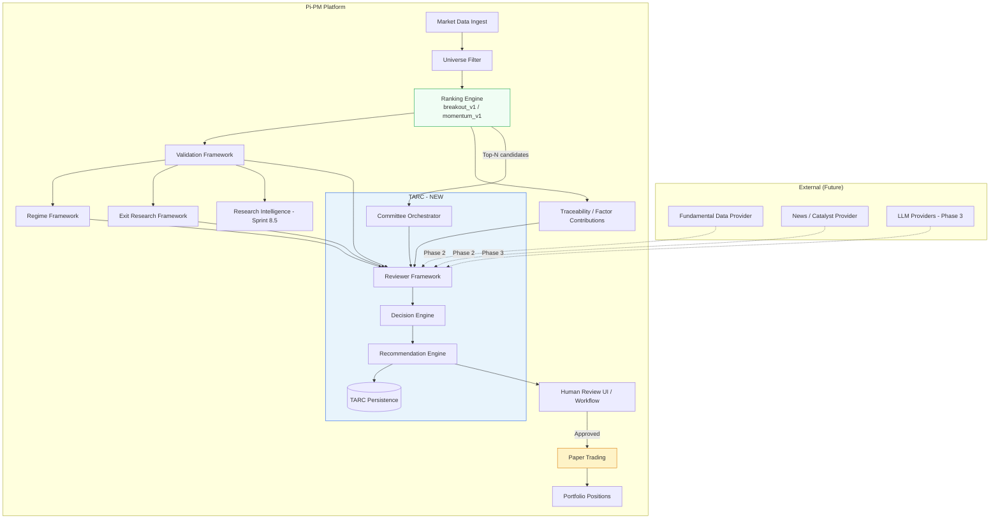
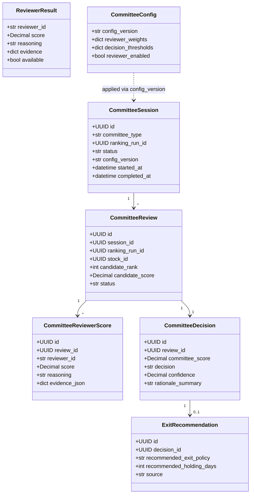
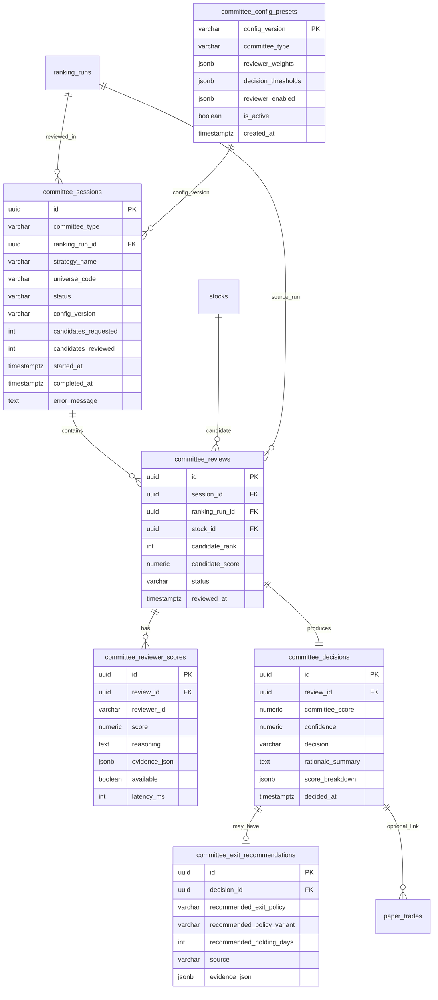
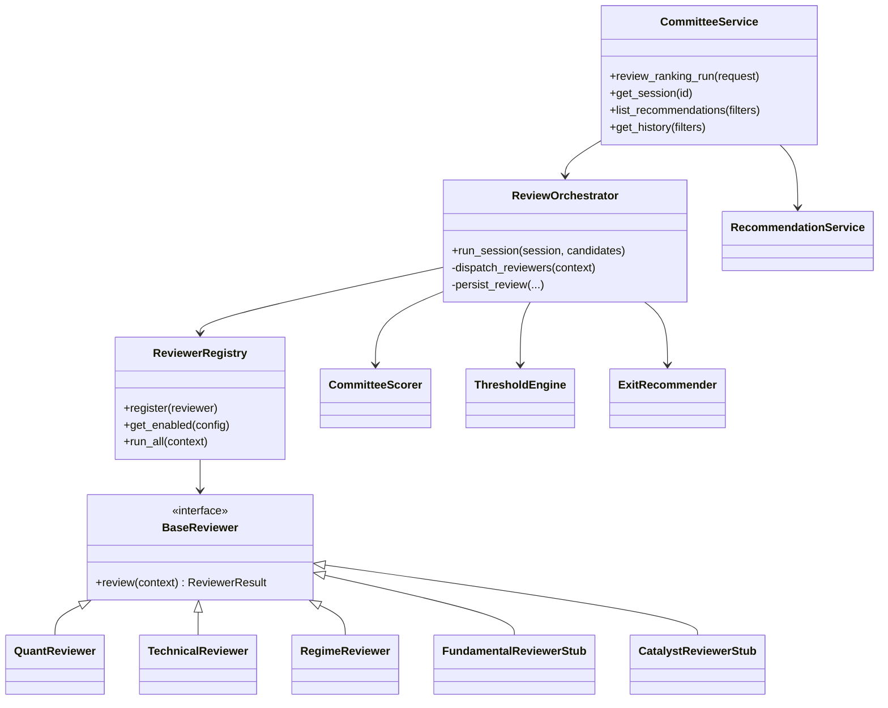
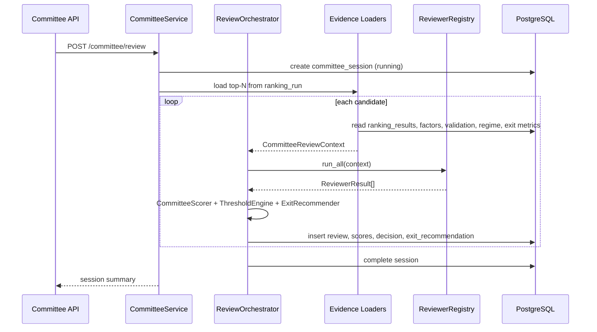
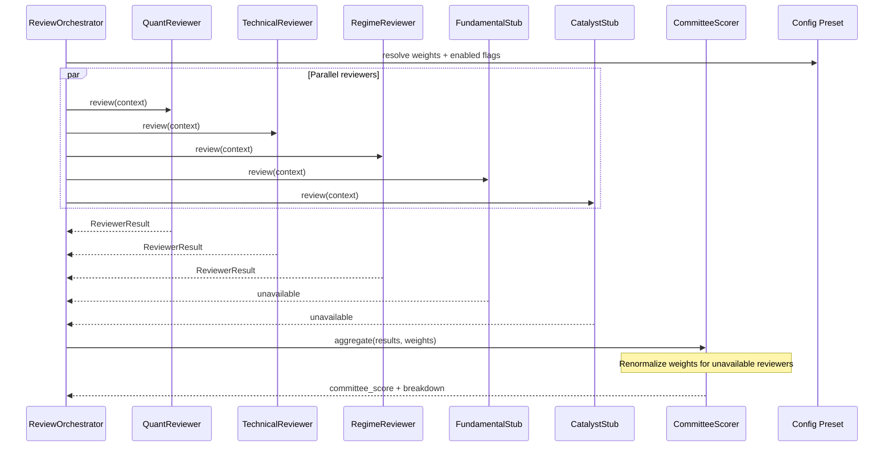
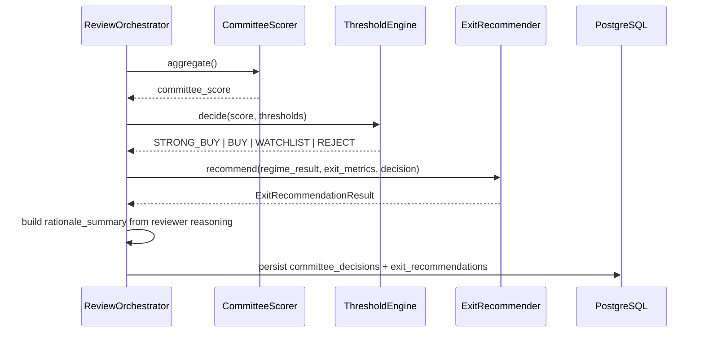

# Trading AI Review Committee (TARC) — Architecture Design Package

**Status:** Architecture & implementation planning only (no code)  
**Authoring date:** 2026-06-02  
**Pi-PM branch context:** `feature/sprint-8.3-exit-research` (post exit research + research intelligence)  
**Takeover:** `docs/HANDOFF.md`, `docs/ARCHITECTURE.md`, `docs/domain-boundaries.md`

---

## Executive Summary

TARC is an **additive, read-mostly review layer** that sits between the deterministic ranking engine and human or paper-trade execution. It does **not** generate investment ideas, modify rankings, or override risk gates. It consumes frozen quantitative artifacts (ranking runs, factor contributions, validation metrics, regime history, exit research) and produces **auditable committee decisions** with per-reviewer scores, rationale, and exit/holding recommendations.

**Non-negotiable alignment with Pi-PM:**

| Principle | TARC interpretation |
|-----------|---------------------|
| Deterministic money logic | V1 reviewers are **rule-based scorers**; no LLM in approval path until Phase 3 and only behind explicit gates |
| LLM isolation | LLMs may assist narrative in Phase 3; they never become sole approvers in V1–V2 |
| Layered domains | New package `app/committee/` owns review logic; services orchestrate; repos persist |
| Research before production | TARC recommendations are advisory until human or policy workflow promotes to `paper_trades` |
| Idempotency | Committee reviews keyed by `(ranking_run_id, stock_id, committee_type, config_version)` |

---

## 1. System Context Diagram



**Context boundaries:**

| System | Relationship to TARC |
|--------|----------------------|
| Ranking Engine | **Upstream producer** of candidates; TARC never writes `ranking_results` |
| Validation / Regime / Exit Research | **Read-only evidence** for reviewers |
| Paper Trading | **Downstream consumer** of approved decisions (optional FK) |
| Research Intelligence | **Parallel consumer** of same artifacts; no hard dependency |
| Future LLM components | **Pluggable reviewers** behind `BaseReviewer` interface |

---

## 2. Component Architecture

### 2.1 Package layout (proposed)

```
app/committee/                    # Domain: review logic only
  __init__.py
  constants.py                    # Decision labels, default weights/thresholds
  models.py                       # Domain dataclasses (not SQLAlchemy)
  context.py                      # CommitteeReviewContext (immutable input bundle)
  registry.py                     # ReviewerRegistry
  reviewers/
    base.py                       # BaseReviewer protocol/ABC
    quant_reviewer.py             # Phase 1
    technical_reviewer.py         # Phase 1
    regime_reviewer.py            # Phase 1
    fundamental_reviewer.py       # Phase 1 stub
    catalyst_reviewer.py          # Phase 1 stub
  scoring/
    weight_resolver.py            # Config-driven weights
    committee_scorer.py           # Weighted aggregate
  decision/
    threshold_engine.py           # STRONG_BUY / BUY / WATCHLIST / REJECT
  recommendation/
    exit_recommender.py           # Maps exit research → holding period + policy
  evidence/
    loaders.py                    # Read-only loaders from repos (no SQL in reviewers)

app/services/
  committee_service.py            # Public application service
  committee_orchestrator.py       # Session lifecycle, parallel reviewer dispatch
  recommendation_service.py       # Query approved / watchlist

app/db/repositories/
  committee_session_repository.py
  committee_review_repository.py
  committee_decision_repository.py
  committee_reviewer_score_repository.py
  committee_config_repository.py

app/models/
  committee.py                    # SQLAlchemy ORM

app/schemas/
  committee.py                    # Pydantic API contracts

app/api/v1/
  committee.py                    # REST router (Phase 1)
```

### 2.2 Component responsibilities

| Component | Responsibility | Must NOT |
|-----------|----------------|----------|
| **Committee Orchestrator** | Open session, load candidates, invoke reviewers, persist results, close session | Change rankings, place trades |
| **Reviewer Framework** | Uniform `review(context) → ReviewerResult`; timeout isolation; evidence attachment | Access DB directly (use loaders) |
| **Reviewer Registry** | Register reviewers by `reviewer_id`; filter by committee type / config | Hard-code reviewer list in orchestrator |
| **Decision Engine** | Apply configurable thresholds to `committee_score` | Override human risk gates |
| **Recommendation Engine** | Merge regime reviewer exit hints + quant horizon signals → `ExitRecommendation` | Optimize portfolio |
| **Persistence Layer** | Idempotent upserts, audit JSON, lineage FKs | Embed scoring formulas |

### 2.2 Orchestration flow (logical)

```
CommitteeService.review_candidates(request)
  → CommitteeOrchestrator.start_session()
  → for each candidate:
       build CommitteeReviewContext (rank, factors, validation, regime, exit metrics)
       ReviewerRegistry.run_all(context)  # parallel in Phase 1.1+
       CommitteeScorer.aggregate(reviewer_results, weights)
       ThresholdEngine.decide(committee_score)
       ExitRecommender.recommend(regime_result, exit_research_lookup)
       persist CommitteeReview + ReviewerScores + CommitteeDecision
  → CommitteeOrchestrator.complete_session()
```

---

## 3. Domain Model

### 3.1 Entity relationship (conceptual UML)



### 3.2 Domain dataclasses (`app/committee/models.py`)

| Type | Purpose |
|------|---------|
| `CommitteeReviewContext` | Immutable input: stock, rank, score, factor vector, rank/score history, validation slice, regime label, exit policy leaderboard row |
| `ReviewerResult` | `reviewer_id`, `score` (0–100), `reasoning`, `evidence`, `available`, `latency_ms` |
| `CommitteeScore` | Weighted aggregate + per-reviewer breakdown |
| `CommitteeDecisionResult` | `decision`, `committee_score`, `confidence`, `rationale_summary` |
| `ExitRecommendationResult` | `policy_family`, `policy_variant`, `holding_days`, `confidence`, `evidence_refs` |

### 3.3 Committee types (extensibility)

| `committee_type` | Use case |
|------------------|----------|
| `TRADING_EQUITY_V1` | Default: review top-N from ranking run |
| `REBALANCE_V1` | Future: existing positions |
| `RISK_OVERRIDE_V1` | Future: compliance committee |

Registry selects reviewer sets per `committee_type`.

---

## 4. Database Design

### 4.1 ERD



### 4.2 Table specifications

#### `committee_config_presets`

| Column | Type | Notes |
|--------|------|-------|
| `config_version` | VARCHAR(32) PK | e.g. `tarc_v1_default` |
| `committee_type` | VARCHAR(32) | |
| `reviewer_weights` | JSONB | `{"quant":0.30,"technical":0.20,...}` |
| `decision_thresholds` | JSONB | `{"strong_buy":85,"buy":75,"watchlist":65}` |
| `reviewer_enabled` | JSONB | `{"fundamental":false,"catalyst":false}` |
| `is_active` | BOOLEAN | One active per type |
| `created_at` | TIMESTAMPTZ | |

#### `committee_sessions`

| Column | Type | Notes |
|--------|------|-------|
| `id` | UUID PK | |
| `committee_type` | VARCHAR(32) | |
| `ranking_run_id` | UUID FK → `ranking_runs` | |
| `strategy_name` | VARCHAR(64) | Denormalized for queries |
| `strategy_version` | VARCHAR(32) | |
| `universe_code` | VARCHAR(64) | |
| `status` | VARCHAR(16) | `pending`, `running`, `completed`, `failed` |
| `config_version` | VARCHAR(32) FK logical | |
| `candidates_requested` | INT | e.g. top 20 |
| `candidates_reviewed` | INT | |
| `parameter_set` | JSONB | Snapshot of request options |
| `started_at` | TIMESTAMPTZ | |
| `completed_at` | TIMESTAMPTZ NULL | |
| `error_message` | TEXT NULL | |

**Indexes:** `(ranking_run_id)`, `(status, started_at DESC)`, `(committee_type, started_at DESC)`

#### `committee_reviews`

| Column | Type | Notes |
|--------|------|-------|
| `id` | UUID PK | |
| `session_id` | UUID FK → `committee_sessions` ON DELETE CASCADE | |
| `ranking_run_id` | UUID FK | |
| `stock_id` | UUID FK → `stocks` | |
| `candidate_rank` | INT | Rank at review time |
| `candidate_score` | NUMERIC(18,8) | |
| `status` | VARCHAR(16) | `pending`, `completed`, `failed` |
| `reviewed_at` | TIMESTAMPTZ | |

**Unique:** `(session_id, stock_id)`  
**Indexes:** `(ranking_run_id, stock_id)`, `(session_id, candidate_rank)`

#### `committee_reviewer_scores`

| Column | Type | Notes |
|--------|------|-------|
| `id` | UUID PK | |
| `review_id` | UUID FK → `committee_reviews` ON DELETE CASCADE | |
| `reviewer_id` | VARCHAR(32) | `quant`, `technical`, `fundamental`, `catalyst`, `regime` |
| `score` | NUMERIC(8,4) NULL | 0–100; NULL if unavailable |
| `reasoning` | TEXT | Human-readable |
| `evidence_json` | JSONB | Structured inputs used |
| `available` | BOOLEAN | False for stub reviewers |
| `latency_ms` | INT | Observability |

**Unique:** `(review_id, reviewer_id)`

#### `committee_decisions`

| Column | Type | Notes |
|--------|------|-------|
| `id` | UUID PK | |
| `review_id` | UUID FK UNIQUE | One decision per review |
| `committee_score` | NUMERIC(8,4) | Weighted 0–100 |
| `confidence` | NUMERIC(8,4) | Derived from score dispersion / evidence coverage |
| `decision` | VARCHAR(16) | `STRONG_BUY`, `BUY`, `WATCHLIST`, `REJECT` |
| `rationale_summary` | TEXT | Concatenated / templated summary |
| `score_breakdown` | JSONB | Per-reviewer weighted contributions |
| `decided_at` | TIMESTAMPTZ | |

**Indexes:** `(decision, decided_at DESC)`, `(committee_score DESC)`

#### `committee_exit_recommendations`

| Column | Type | Notes |
|--------|------|-------|
| `id` | UUID PK | |
| `decision_id` | UUID FK UNIQUE → `committee_decisions` | |
| `recommended_exit_policy` | VARCHAR(32) | e.g. `FIXED_HOLD` |
| `recommended_policy_variant` | VARCHAR(64) | e.g. `FIXED_HOLD_20` |
| `recommended_holding_days` | INT | |
| `source` | VARCHAR(32) | `exit_research`, `regime_default`, `config_fallback` |
| `evidence_json` | JSONB | FK refs to exit_research_policy_metrics rows |

#### `paper_trades` (additive column, Phase 1.1)

| Column | Type | Notes |
|--------|------|-------|
| `committee_decision_id` | UUID FK NULL → `committee_decisions` | Traceability when trade placed |

### 4.3 Idempotency key

**Unique business key:** `(ranking_run_id, stock_id, committee_type, config_version)` on `committee_reviews` via session reuse policy:

- **Option A (recommended):** One session per `POST /committee/review`; re-POST with same idempotency key returns existing session.
- **Option B:** Upsert review row per candidate within session.

Store `idempotency_key` on `committee_sessions`.

---

## 5. Service Architecture

### 5.1 Interface definitions (conceptual)

```python
# app/committee/reviewers/base.py
class BaseReviewer(Protocol):
    reviewer_id: str

    def review(self, context: CommitteeReviewContext) -> ReviewerResult: ...

# app/committee/scoring/committee_scorer.py
class CommitteeScorer:
    def aggregate(
        self,
        results: list[ReviewerResult],
        weights: dict[str, float],
    ) -> CommitteeScore: ...

# app/committee/decision/threshold_engine.py
class ThresholdEngine:
    def decide(
        self,
        committee_score: Decimal,
        thresholds: dict[str, int],
    ) -> CommitteeDecisionResult: ...

# app/services/committee_orchestrator.py
class ReviewOrchestrator:
    def run_session(self, session: CommitteeSession, candidates: list[Candidate]) -> None: ...

# app/services/committee_service.py
class CommitteeService:
    def review_ranking_run(self, request: ReviewRequest) -> CommitteeSession: ...
    def get_session(self, session_id: UUID) -> SessionDetail: ...
    def list_recommendations(self, filters: RecommendationFilters) -> list[RecommendationDTO]: ...
    def get_history(self, filters: HistoryFilters) -> list[HistoryDTO]: ...

# app/services/recommendation_service.py
class RecommendationService:
    def get_actionable(self, *, min_decision: str, universe_code: str) -> list[ActionableCandidate]: ...
```

### 5.2 Class diagram (services + domain)



### 5.3 Evidence loaders (read-only)

| Loader | Source tables | Used by |
|--------|---------------|---------|
| `RankingEvidenceLoader` | `ranking_results`, `ranking_factor_contributions` | Quant, Technical |
| `RankHistoryLoader` | prior `ranking_runs` / `ranking_results` | Quant |
| `ValidationEvidenceLoader` | `ranking_validation_reports`, `validation_horizon_metrics` | Quant |
| `RegimeEvidenceLoader` | `regime_history`, `strategy_regime_performance` | Regime |
| `ExitResearchEvidenceLoader` | `exit_research_policy_metrics` | Regime |

Loaders live in `app/committee/evidence/loaders.py` and use existing repositories — **no new SQL in reviewer classes**.

---

## 6. API Design

**Prefix:** `/api/v1/committee`  
**Tag:** `committee`

### 6.1 `POST /api/v1/committee/review`

Trigger committee review for top-N candidates from a completed ranking run.

**Request:**

```json
{
  "ranking_run_id": "550e8400-e29b-41d4-a716-446655440000",
  "committee_type": "TRADING_EQUITY_V1",
  "config_version": "tarc_v1_default",
  "top_n": 20,
  "dataset_split": "HOLDOUT",
  "idempotency_key": "review-2026-06-02-breakout-nifty500",
  "async": false
}
```

**Response (sync):**

```json
{
  "session_id": "7c9e6679-7425-40de-944b-e07fc1f90ae7",
  "status": "completed",
  "committee_type": "TRADING_EQUITY_V1",
  "ranking_run_id": "550e8400-e29b-41d4-a716-446655440000",
  "candidates_reviewed": 20,
  "summary": {
    "strong_buy": 2,
    "buy": 5,
    "watchlist": 8,
    "reject": 5
  },
  "completed_at": "2026-06-02T14:32:00Z"
}
```

**Response (async, Phase 1.1):** `202 Accepted` + `session_id`; poll `GET /committee/session/{id}`.

### 6.2 `GET /api/v1/committee/session/{session_id}`

**Response:**

```json
{
  "session_id": "7c9e6679-7425-40de-944b-e07fc1f90ae7",
  "status": "completed",
  "committee_type": "TRADING_EQUITY_V1",
  "config_version": "tarc_v1_default",
  "ranking_run_id": "550e8400-e29b-41d4-a716-446655440000",
  "strategy_name": "breakout_v1",
  "universe_code": "NIFTY_500",
  "started_at": "2026-06-02T14:30:00Z",
  "completed_at": "2026-06-02T14:32:00Z",
  "reviews": [
    {
      "review_id": "...",
      "stock_id": "...",
      "symbol": "RELIANCE.NS",
      "candidate_rank": 1,
      "candidate_score": 8.42,
      "decision": "STRONG_BUY",
      "committee_score": 87.3,
      "confidence": 0.91,
      "rationale_summary": "Strong quant validation in BULL_LOW_VOL; rank improving; regime supports 20d hold.",
      "reviewer_scores": [
        {"reviewer_id": "quant", "score": 92.0, "available": true},
        {"reviewer_id": "technical", "score": 85.0, "available": true},
        {"reviewer_id": "fundamental", "score": null, "available": false},
        {"reviewer_id": "catalyst", "score": null, "available": false},
        {"reviewer_id": "regime", "score": 88.0, "available": true}
      ],
      "exit_recommendation": {
        "recommended_exit_policy": "FIXED_HOLD",
        "recommended_policy_variant": "FIXED_HOLD_20",
        "recommended_holding_days": 20,
        "source": "exit_research"
      }
    }
  ]
}
```

### 6.3 `GET /api/v1/committee/recommendations`

Filter actionable candidates across sessions.

**Query:** `decision=STRONG_BUY|BUY`, `universe_code`, `strategy_name`, `since`, `limit`

**Response:**

```json
{
  "recommendations": [
    {
      "decision_id": "...",
      "session_id": "...",
      "symbol": "RELIANCE.NS",
      "decision": "STRONG_BUY",
      "committee_score": 87.3,
      "recommended_holding_days": 20,
      "ranking_run_id": "...",
      "decided_at": "2026-06-02T14:32:00Z"
    }
  ]
}
```

### 6.4 `GET /api/v1/committee/history`

Paginated audit trail for a stock or strategy.

**Query:** `stock_id`, `symbol`, `strategy_name`, `from_date`, `to_date`, `limit`, `offset`

**Response:** List of past `committee_decisions` with reviewer score snapshots.

### 6.5 `GET /api/v1/committee/config`

Return active `committee_config_presets` (weights + thresholds) for UI transparency.

---

## 7. Sequence Diagrams

### 7.1 Stock candidate review flow



### 7.2 Committee scoring flow



**Weight renormalization (V1):** If fundamental/catalyst unavailable, redistribute their combined 35% proportionally across available reviewers (configurable policy: `renormalize_weights: true`).

### 7.3 Decision generation flow



---

## 8. Reviewer Specifications (V1)

### 8.1 Quant Reviewer (implemented Phase 1)

| Input | Signal |
|-------|--------|
| `validation_horizon_metrics` | IC, spread, sample_size @ 20d |
| Rank history (last K runs) | Δrank, rank stability |
| Score history | Δscore |
| `ranking_validation_reports.regime_label` | Regime context |

| Scoring logic (deterministic) | Points |
|-------------------------------|--------|
| IC > 0.03 in current regime | +25 |
| Positive spread | +25 |
| Rank improved vs prior run | +20 |
| Score improved | +15 |
| Sample size ≥ 30 | +15 |

**Output:** `quant_score` 0–100, `quant_reasoning`, `evidence_json` with metric IDs.

### 8.2 Technical Reviewer (implemented Phase 1)

| Input | Source |
|-------|--------|
| Factor contributions | `ranking_factor_contributions` |
| Relative strength, volume surge, trend quality, ATR expansion, breakout | Factor keys from `breakout_v1` registry |

| Scoring logic | Points |
|---------------|--------|
| Breakout factor percentile > 80 | +30 |
| Volume surge confirms | +25 |
| Trend quality pass | +25 |
| ATR expansion favorable | +20 |

**Output:** `technical_score`, `technical_reasoning`.

### 8.3 Regime Reviewer (implemented Phase 1)

| Input | Source |
|-------|--------|
| `regime_history` | Current regime |
| `strategy_regime_performance` | breakout_v1 performance by regime |
| `exit_research_policy_metrics` | Best hold / exit variant for regime + HOLDOUT |

| Questions answered | Method |
|--------------------|--------|
| Does regime support breakout_v1? | `strategy_regime_performance` spread sign |
| Best holding period? | Max mean_return `FIXED_HOLD_*` row with n≥30 |

**Output:** `regime_score`, `regime_reasoning`, `recommended_exit_policy`, `recommended_holding_days`.

### 8.4 Fundamental Reviewer (stub Phase 1)

```python
class FundamentalReviewer(BaseReviewer):
    reviewer_id = "fundamental"

    def review(self, context: CommitteeReviewContext) -> ReviewerResult:
        return ReviewerResult(
            reviewer_id=self.reviewer_id,
            score=None,
            reasoning="Fundamental data provider not configured (V1 stub).",
            evidence={},
            available=False,
        )
```

**Phase 2:** Implement `FundamentalDataPort` interface + adapter.

### 8.5 Catalyst Reviewer (stub Phase 1)

Same pattern as fundamental with `CatalystDataPort` for news/sentiment.

---

## 9. Phased Implementation Plan

### Phase 1 — Core committee (8–10 weeks engineering estimate)

| Sprint slice | Deliverable |
|--------------|-------------|
| 1.1 Infrastructure | Migration, ORM, repos, config presets seed, constants |
| 1.2 Framework | `BaseReviewer`, `ReviewerRegistry`, `CommitteeReviewContext`, evidence loaders |
| 1.3 Scoring & decision | `CommitteeScorer`, `ThresholdEngine`, weight renormalization |
| 1.4 Reviewers | Quant, Technical, Regime (deterministic) + Fundamental/Catalyst stubs |
| 1.5 Orchestration | `ReviewOrchestrator`, `CommitteeService`, idempotency |
| 1.6 API | `POST /review`, `GET /session/{id}`, `GET /recommendations`, `GET /history` |
| 1.7 Tests | Unit per reviewer, golden fixtures, integration API, regression vs frozen evidence |
| 1.8 Docs | Runbook, domain-boundaries update, HANDOFF |

**Exit criteria:** Review top-20 from NIFTY_500 ranking run; full audit trail; no changes to ranking/validation.

### Phase 2 — External data (4–6 weeks)

| Item | Deliverable |
|------|-------------|
| `FundamentalDataPort` | Interface + mock + one provider adapter |
| `CatalystDataPort` | Interface + mock + one provider adapter |
| Enable reviewers | `reviewer_enabled.fundamental = true` in config |
| Caching layer | TTL cache for external calls |
| Failure modes | Degrade to unavailable; renormalize weights |

### Phase 3 — LLM & advanced committee (research spike → implementation)

| Item | Deliverable |
|------|-------------|
| `LLMReviewer` base | Prompt templates, schema-validated JSON output, cost caps |
| Contrarian reviewer | Challenges consensus; does not veto alone |
| Debate system | Multi-round reviewer messages stored in `committee_review_debates` (new table) |
| Human-in-the-loop | Mandatory approval gate before `paper_trades` |

**Hard gate:** LLM output cannot be sole input to `STRONG_BUY`; must combine with deterministic floor score.

### Phase 1.1 — Paper trade linkage (optional fast follow)

- Add `committee_decision_id` to `paper_trades`
- `POST /paper-trades` accepts optional `decision_id` with validation that decision is `BUY+`

---

## 10. Non-Functional Requirements

| NFR | Target | Approach |
|-----|--------|----------|
| **Performance** | Review 20 candidates < 30s P95 (V1 deterministic) | Parallel reviewers; batch evidence loaders per session |
| **Scalability** | 500 candidates async batch | `async=true` session + worker queue (Celery/ARQ — align with future Sprint 6.2 async validation) |
| **Auditability** | Full replay from stored evidence | `evidence_json` + config_version snapshot on session |
| **Traceability** | Lineage to ranking_run | FKs + optional `lineage_events` integration (Sprint 7 pattern) |
| **Explainability** | Every score decomposable | `score_breakdown` JSONB + per-reviewer reasoning |
| **Observability** | Structured logs | `committee_session_started`, `committee_review_completed`, `committee_decision` events |
| **Testability** | Golden contexts | Fixture JSON per reviewer; no DB in unit tests |

### 10.1 Security & compliance

- No PII in evidence bundles
- External API keys in secrets manager (Phase 2)
- Rate limits on `POST /committee/review`

### 10.2 Configuration management

All weights and thresholds in `committee_config_presets` — never hard-coded in reviewers. Changes require new `config_version` for audit comparison.

---

## 11. Integration with Existing Pi-PM (unchanged systems)

| System | Integration point |
|--------|-------------------|
| Ranking | Input: `ranking_run_id` + top-N `ranking_results` |
| Validation | Read-only metrics for quant reviewer |
| Regime | `regime_history` + `strategy_regime_performance` |
| Exit research | `exit_research_policy_metrics` for regime reviewer |
| Paper trading | Optional FK on trade; human promotes decision |
| Research intelligence | May display committee summaries (future report section) |

**Explicit non-modifications:** `app/ranking/**`, `app/validation/**`, `app/regime_policy/**`, `app/factor_analytics/**`, `app/workspace_exit_research/**`.

---

## 12. Default configuration (V1 seed)

```json
{
  "config_version": "tarc_v1_default",
  "committee_type": "TRADING_EQUITY_V1",
  "reviewer_weights": {
    "quant": 0.30,
    "technical": 0.20,
    "fundamental": 0.20,
    "catalyst": 0.15,
    "regime": 0.15
  },
  "decision_thresholds": {
    "strong_buy": 85,
    "buy": 75,
    "watchlist": 65
  },
  "reviewer_enabled": {
    "quant": true,
    "technical": true,
    "fundamental": false,
    "catalyst": false,
    "regime": true
  },
  "renormalize_weights_when_unavailable": true
}
```

---

## 13. Risks & mitigations

| Risk | Mitigation |
|------|------------|
| Committee contradicts validation research | Regime reviewer grounded in `strategy_regime_performance`; quant uses same metrics |
| Over-reliance on unavailable reviewers | Renormalize weights; show `available=false` in UI |
| LLM hallucination (Phase 3) | Schema validation + deterministic floor + human gate |
| Latency on rank history | Materialized view or cache last 5 runs per stock (Phase 1.1) |

---

## 14. Open questions (for product sign-off)

1. Should `WATCHLIST` auto-refresh on next ranking run or expire?
2. Is async batch review required for Phase 1 or Phase 1.1?
3. Can `STRONG_BUY` bypass human review for paper trading, or always require explicit click?
4. Should committee review **momentum_v1** and **breakout_v1** in one session or separate sessions per strategy?

---

## 15. Related artifacts (to create during implementation)

| Artifact | Phase |
|----------|-------|
| `docs/tarc-runbook.md` | 1.8 |
| `migrations/20260xxx_committee_tables.py` | 1.1 |
| `scripts/seed_committee_config_presets.py` | 1.1 |
| `tests/fixtures/committee/` golden contexts | 1.7 |

---

## Appendix A — Decision confidence formula (V1 proposal)

```
confidence = committee_score / 100
           * (available_reviewers / total_enabled_reviewers)
           * (1 - normalized_score_variance_across_reviewers)
```

Tune during Phase 1 testing; store formula version in `parameter_set`.

---

## Appendix B — Future: agent-based reviewers

`AgentReviewer(BaseReviewer)` with:

- `tools`: read-only repository facades
- `memory`: session-scoped, not global
- `output_schema`: Pydantic `ReviewerResult`
- `budget`: max tokens / max latency

Registered alongside deterministic reviewers in `ReviewerRegistry`.

---

*End of architecture package. No implementation code included by design.*
